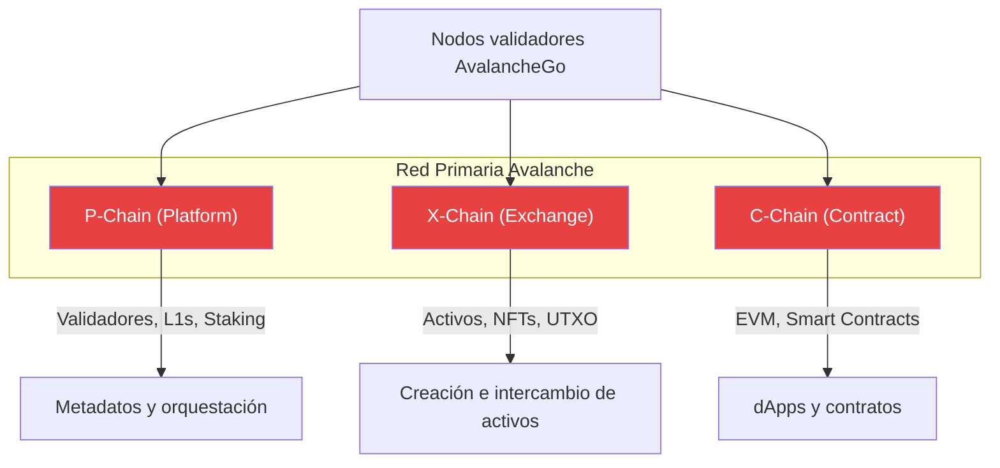
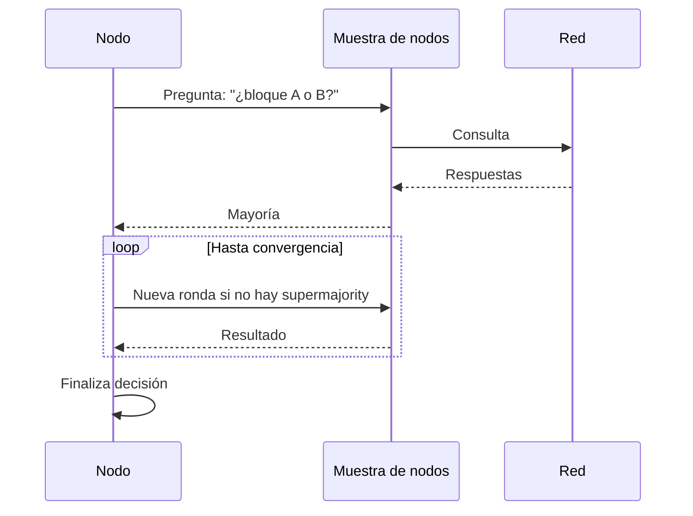
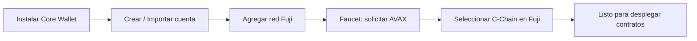

# Semana 1 · Sesión 1 — Fundamentos y Core Wallet

**Fecha:** 2 de marzo  
**Tema:** Introducción al ecosistema Avalanche, consenso y configuración de entorno (Core Wallet).

---

## Objetivos de la sesión

- Entender el ecosistema Avalanche y su posición en Web3.
- Conocer el consenso Avalanche y por qué permite finalidad rápida y escalabilidad.
- Configurar Core Wallet y tener acceso a redes de prueba (Fuji).

---

## 1. Ecosistema Avalanche

La **Red Primaria** de Avalanche está formada por **tres cadenas** con roles complementarios, todas validadas por los mismos nodos AvalancheGo.

### Las tres cadenas de la Red Primaria

| Cadena | Nombre completo | Función principal | VM / Consenso |
|--------|-----------------|-------------------|----------------|
| **P-Chain** | Platform Chain | Validadores, staking, L1s, creación de blockchains | PlatformVM, Snowman++ |
| **X-Chain** | Exchange Chain | Creación e intercambio de activos (AVAX, NFTs) | AVM, Snowman |
| **C-Chain** | Contract Chain | Smart contracts y dApps (EVM) | Coreth (EVM), Snowman++ |

- **Finalidad:** sub-segundos (vs minutos en otras redes).
- **Escalabilidad:** L1s personalizadas sin congestionar la red principal.

### Diagrama: Red Primaria (P, X, C-Chain)

### Imagen de referencia — Builders Hub

> **Fuente:** [Avalanche Builder Hub — Architecture](https://build.avax.network/docs/nodes/architecture)  
> Puedes reemplazar el diagrama anterior por una captura oficial si lo prefieres.

<!-- ========== ESPACIO PARA IMAGEN: Builders Hub — Red Primaria ========== -->
<!-- Guarda en semana-1/assets/ una captura y nómbrala primary-network-architecture.png -->
<!-- Luego descomenta la línea siguiente: -->
<!--  -->

| Inserte aquí imagen del Builders Hub | [Enlace: Architecture](https://build.avax.network/docs/nodes/architecture) |
|-------------------------------------|-----------------------------------------------------------------------------|
| Guardar como `./assets/primary-network-architecture.png` | *Opcional* |

---

## 2. Consenso Avalanche

El consenso Avalanche se basa en **muestreo repetido**: cada nodo pregunta a un subconjunto aleatorio de nodos y, tras varias rondas, el sistema converge a un acuerdo con alta probabilidad. Eso permite:

- **Finalidad rápida** (sub-segundos).
- **Escalabilidad** (miles de validadores sin cuello de botella).
- **Resistencia** (tolerante a fallos bizantinos).

**Avalanche9000** es la evolución de este modelo (más rendimiento y flexibilidad); lo verás en detalle en Semana 2.

### Diagrama: flujo del consenso (simplificado)

### Imagen de referencia — Consenso

> **Fuente:** [PlatformVM Architecture](https://build.avax.network/docs/primary-network/platformvm-architecture) y docs de consenso en el Builders Hub.

<!-- ========== ESPACIO PARA IMAGEN: Builders Hub — Consenso ========== -->
<!-- Guardar como ./assets/consensus-avalanche.png y descomentar: -->
<!--  -->

| Inserte aquí imagen del Builders Hub (consenso / PlatformVM) | [Enlace: PlatformVM](https://build.avax.network/docs/primary-network/platformvm-architecture) |
|-------------------------------------------------------------|-----------------------------------------------------------------------------------------------|
| Guardar como `./assets/consensus-avalanche.png` | *Opcional* |

---

## 3. Configuración de entorno — Core Wallet

### Instalación

1. **Core Wallet (navegador):**
   - [Core Wallet](https://core.app/) — extensión para Chrome/Brave/Firefox.
   - Crear o importar wallet y **guardar la frase de recuperación** en un lugar seguro.

2. **Obtener AVAX de prueba (Fuji):**
   - [Faucet Fuji (oficial)](https://faucet.avax.network/)
   - [Core Testnet Faucet](https://core.app/tools/testnet-faucet) — integrado en Core: conectar wallet y solicitar.
   - [Builder Hub — Testnet Faucet](https://build.avax.network/console/primary-network/faucet) — desde la consola del Builders Hub (Red Primaria / Fuji).
   - Seleccionar **Fuji** y la **C-Chain** para desarrollo de contratos.
   - Pegar tu dirección (C-Chain) y solicitar fondos.

### Flujo: Wallet → Fuji → C-Chain

### Verificar

- [ ] Core Wallet instalado.
- [ ] Cuenta creada y frase respaldada.
- [ ] Red **Fuji** agregada y visible en Core.
- [ ] AVAX de prueba en **C-Chain (Fuji)** recibidos.

---

## Tareas sugeridas antes de la Sesión 2

- Revisar la [documentación de la C-Chain](https://docs.avax.network/dapps/smart-contracts/contract-chain-c-chain).
- Tener **Node.js (v18+)** instalado para Foundry/Hardhat.
- Opcional: leer [“What is Avalanche”](https://docs.avax.network/overview/getting-started/avalanche-platform) en docs.avax.network.

---

## Enlaces útiles

- [Avalanche Builder Hub — Docs](https://build.avax.network/docs)
- [Avalanche Builder Hub — Architecture](https://build.avax.network/docs/nodes/architecture)
- [Docs Avalanche — Getting Started](https://docs.avax.network/overview/getting-started/avalanche-platform)
- [Core Wallet](https://core.app/)
- [Fuji Faucet (oficial)](https://faucet.avax.network/)
- [Core Testnet Faucet](https://core.app/tools/testnet-faucet)
- [Builder Hub — Testnet Faucet](https://build.avax.network/console/primary-network/faucet)

[← Volver al índice](../../README.md) · [Siguiente: C-Chain y Solidity →](./02-c-chain-solidity-fuji.md)
