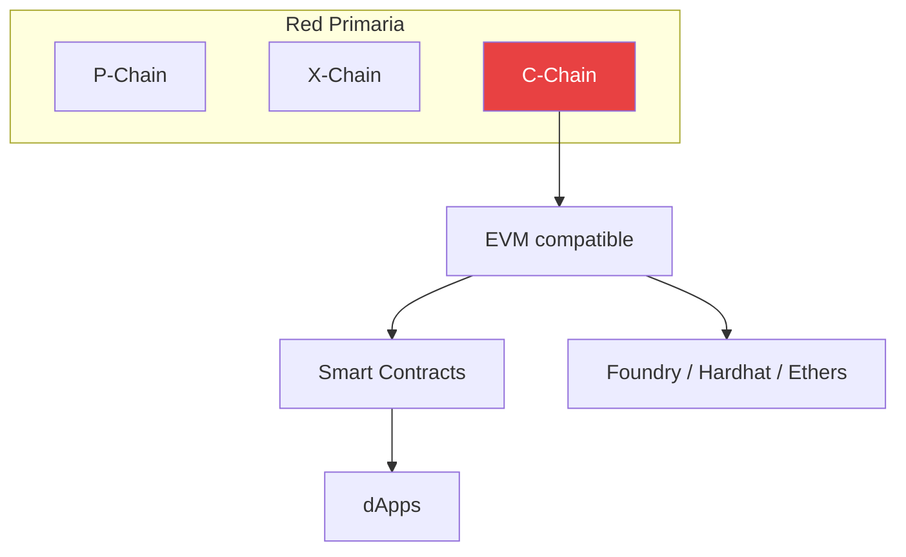
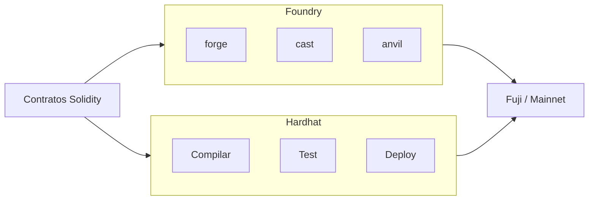
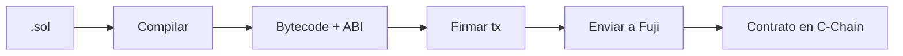
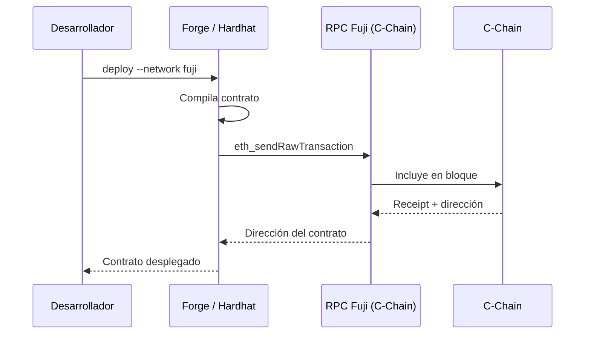

# Semana 1 · Sesión 2 — C-Chain, Solidity y Fuji

**Fecha:** 4 de marzo  
**Instructor:** Adrian Armenta  
**Tema:** Desarrollo en la C-Chain (EVM), Solidity avanzado y despliegue en red de prueba Fuji.

---

## Objetivos de la sesión

- Desarrollar y desplegar contratos en la C-Chain (EVM).
- Usar Solidity con buenas prácticas para Avalanche.
- Configurar Foundry o Hardhat y desplegar en Fuji.

---

## 1. C-Chain (EVM)

La **C-Chain** es la cadena de contratos de Avalanche: **EVM-compatible**, así que el mismo bytecode y las mismas herramientas que en Ethereum funcionan aquí.

| Red | Chain ID | RPC (C-Chain) |
|-----|----------|----------------|
| **Fuji** (testnet) | `43113` | `https://api.avax-test.network/ext/bc/C/rpc` |
| **Mainnet** | `43114` | `https://api.avax.network/ext/bc/C/rpc` |

### Dónde encaja la C-Chain en la Red Primaria



### Imagen de referencia — Builders Hub

> **Fuente:** [Avalanche Builder Hub](https://build.avax.network/docs) — C-Chain / Contract Chain.

<!-- ========== ESPACIO PARA IMAGEN: Builders Hub — C-Chain ========== -->
<!-- Guardar como ./assets/c-chain-ecosystem.png y descomentar: -->
<!--  -->

| Inserte aquí imagen del Builders Hub (C-Chain) | [Enlace: Docs](https://build.avax.network/docs) |
|-----------------------------------------------|--------------------------------------------------|
| Guardar como `./assets/c-chain-ecosystem.png` | *Opcional* |

---

## 2. Herramientas de desarrollo

Puedes usar **Foundry** o **Hardhat**; ambos son compatibles con la C-Chain.

### Comparativa rápida



### Foundry (recomendado)

```bash
curl -L https://foundry.paradigm.xyz | bash
foundryup
```

| Herramienta | Uso |
|-------------|-----|
| `forge` | Compilar, tests, fuzzing, despliegue |
| `cast` | Llamadas RPC, transacciones, conversiones |
| `anvil` | Red local EVM |

### Hardhat

```bash
npm init -y
npm install --save-dev hardhat
npx hardhat init
```

- Plugins útiles: `@nomicfoundation/hardhat-toolbox`, `hardhat-verify` (verificación en Snowtrace).

### Imagen de referencia — Developer workflow

<!-- ========== ESPACIO PARA IMAGEN: Builders Hub — Flujo de desarrollo ========== -->
<!-- Guardar como ./assets/developer-workflow.png y descomentar: -->
<!--  -->

| Inserte aquí imagen del Builders Hub (developer workflow) | [Enlace: Builders Hub Docs](https://build.avax.network/docs) |
|-----------------------------------------------------------|----------------------------------------------------------------|
| Guardar como `./assets/developer-workflow.png` | *Opcional* |

---

## 3. Solidity en Avalanche

- Mismo Solidity que en Ethereum; conviene optimizar **gas** y **storage**.
- En Avalanche el gas suele ser más barato; aun así, buenas prácticas ayudan.
- Usar **Solidity 0.8.x** y el **optimizador** del compilador.

### Flujo: código → compilación → despliegue



### Ejemplo mínimo (Foundry)

```solidity
// SPDX-License-Identifier: MIT
pragma solidity ^0.8.19;

contract HolaAvalanche {
    string public mensaje = "Hola Avalanche desde CriptoUNAM";

    function actualizarMensaje(string calldata _nuevo) external {
        mensaje = _nuevo;
    }
}
```

---

## 4. Desplegar en Fuji

### Con Foundry

1. Crear `.env` con `PRIVATE_KEY` (**nunca** subir a git).
2. Desplegar:

```bash
forge create src/HolaAvalanche.sol:HolaAvalanche \
  --rpc-url https://api.avax-test.network/ext/bc/C/rpc \
  --private-key $PRIVATE_KEY
```

### Con Hardhat

En `hardhat.config.ts` / `hardhat.config.js`:

```javascript
networks: {
  fuji: {
    url: 'https://api.avax-test.network/ext/bc/C/rpc',
    chainId: 43113,
    accounts: process.env.PRIVATE_KEY ? [process.env.PRIVATE_KEY] : [],
  },
}
```

```bash
npx hardhat run scripts/deploy.js --network fuji
```

### Diagrama: despliegue a Fuji



---

## Checklist post-sesión

- [ ] Proyecto Foundry o Hardhat creado.
- [ ] Contrato compilado sin errores.
- [ ] Desplegado en Fuji y dirección anotada.
- [ ] Transacción verificada en [Fuji Snowtrace](https://testnet.snowtrace.io/).

---

## Enlaces útiles

- [Avalanche Builder Hub — Docs](https://build.avax.network/docs)
- [Avalanche C-Chain Docs](https://docs.avax.network/dapps/smart-contracts/contract-chain-c-chain)
- [Foundry Book](https://book.getfoundry.sh/)
- [Hardhat](https://hardhat.org/)
- [Fuji Snowtrace](https://testnet.snowtrace.io/)

[← Sesión 1: Fundamentos](./01-fundamentos-core-wallet.md) · [Volver al índice](../../README.md) · [Siguiente: L1s y Avalanche9000 →](../semana-2/01-subnets-avalanche9000.md)
