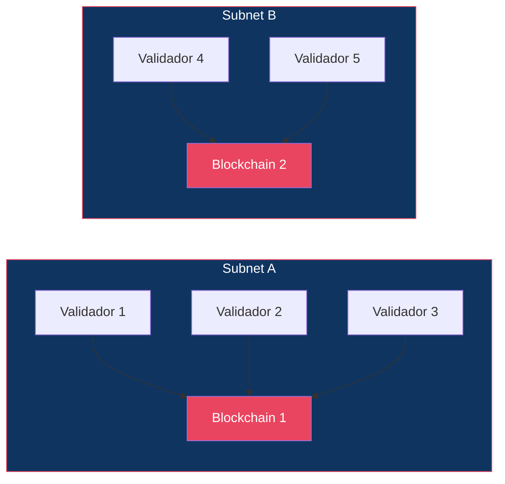
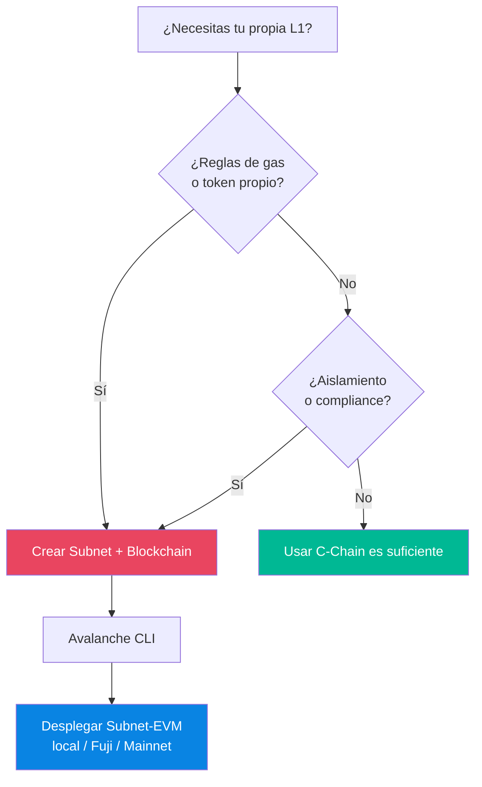
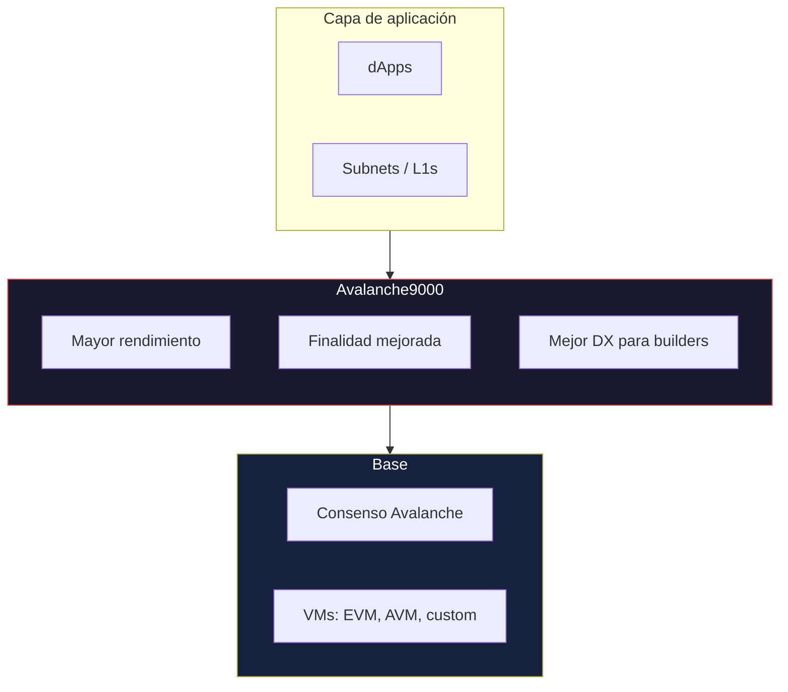
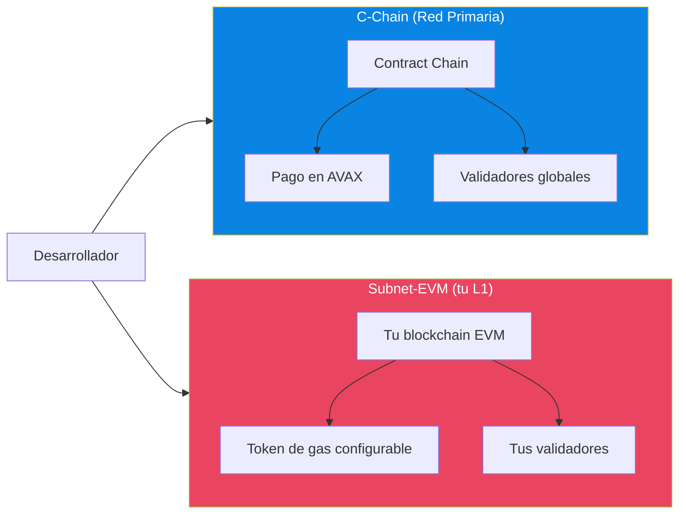
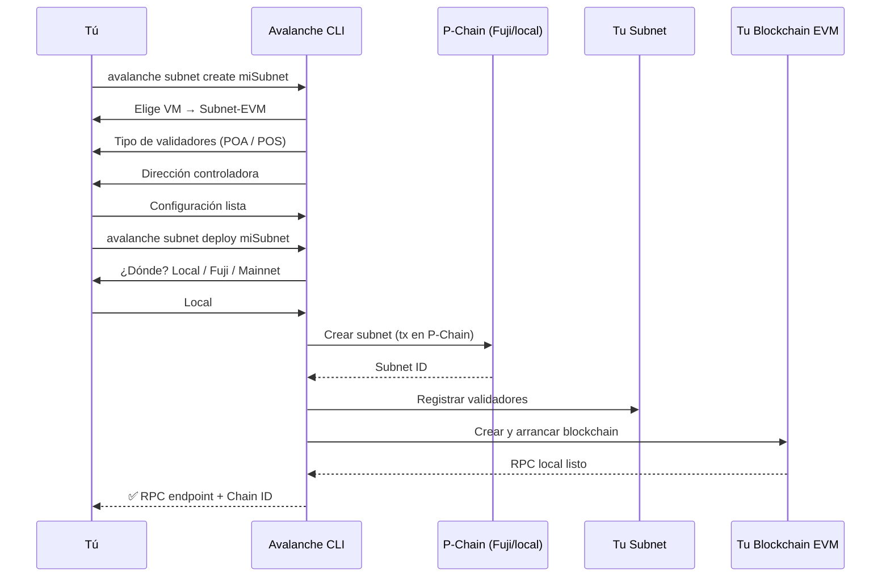
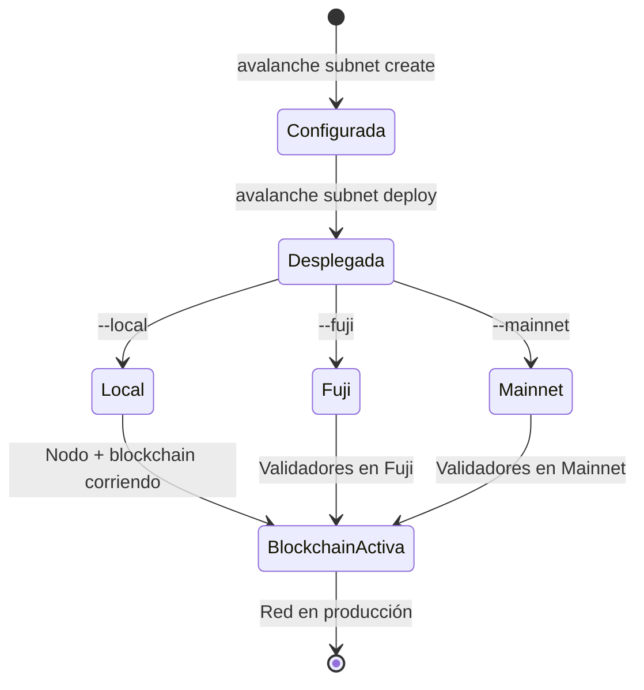
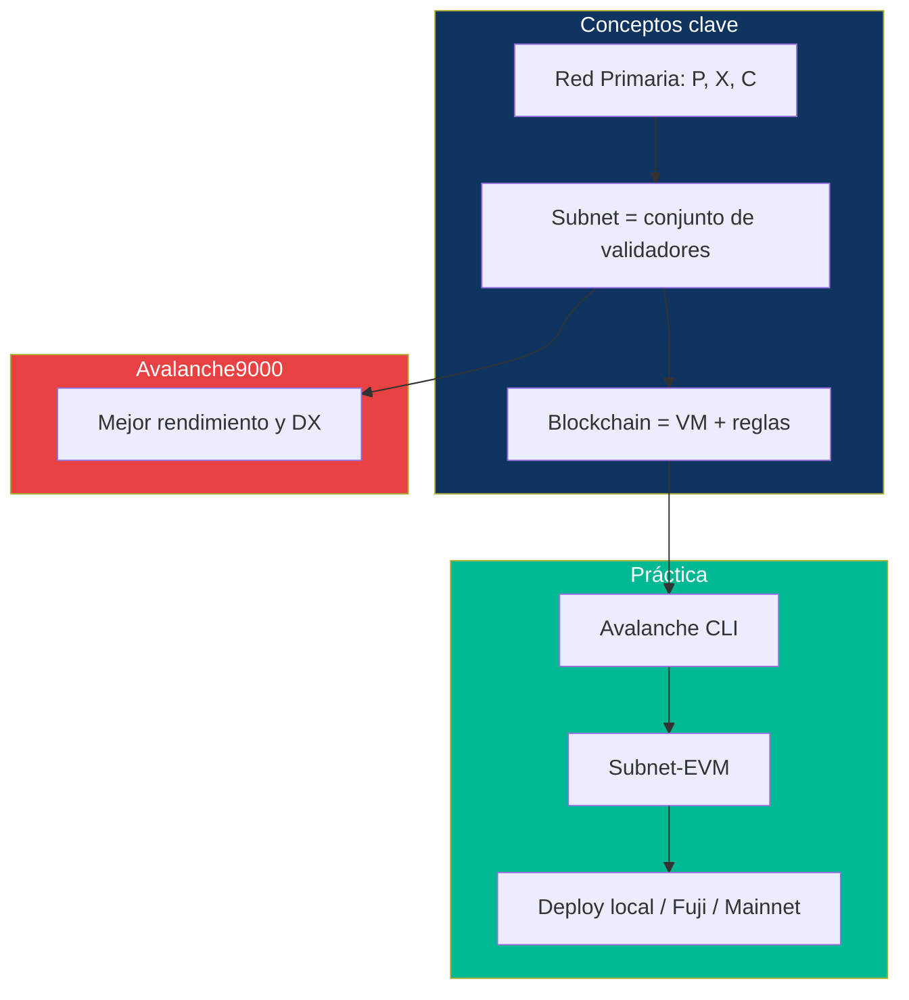

# Semana 2 · Sesión 1 — Subnets y Avalanche9000

**Fecha:** 9 de marzo  
**Instructor:** Andrés Rodriguez  
**Tema:** Revolución de las L1s, arquitectura Avalanche9000 y lanzamiento de una red personalizada local.

---

## Objetivos de la sesión

- Entender el modelo de **subnets** y L1s personalizadas en Avalanche.
- Diferenciar Red Primaria vs subnet y cuándo crear la tuya.
- Conocer la arquitectura **Avalanche9000** y su impacto.
- Lanzar una **red personalizada local** con Avalanche CLI y Subnet-EVM.

---

## 1. De la Red Primaria a las Subnets

### ¿Qué es la Red Primaria?

La **Red Primaria** (Primary Network) es el conjunto de tres cadenas —P-Chain, X-Chain y C-Chain— validadas por un mismo conjunto de validadores. Todos los que hacen staking de AVAX en la Red Primaria deben validar estas tres cadenas.

```mermaid
flowchart TB
    subgraph Primary["🔷 Red Primaria (Primary Network)"]
        direction TB
        P["P-Chain"]
        X["X-Chain"]
        C["C-Chain"]
    end

    V[Validadores con staking AVAX] --> P
    V --> X
    V --> C

    P --> |Metadatos, Subnets| Meta[Orquestación]
    X --> |Activos| Assets[Exchange]
    C --> |Contratos| Dapps[EVM dApps]

    style Primary fill:#1a1a2e,stroke:#e84142,color:#fff
    style P fill:#16213e
    style X fill:#16213e
    style C fill:#16213e
    style V fill:#e84142,color:#fff
```



### ¿Qué es una Subnet?

Una **subnet** (subred) es un **conjunto de validadores** que acuerda validar **una o más blockchains**. Es decir:

- **No** es “una blockchain más”: es la **regla de quién valida qué**.
- Una blockchain puede ser EVM (Subnet-EVM), AVM u otra VM personalizada.
- Esas blockchains solo son validadas por los nodos que pertenecen a esa subnet.



### Red Primaria vs Subnet — Resumen

| Concepto | Red Primaria | Tu Subnet (L1 personalizada) |
|----------|--------------|------------------------------|
| **Quién valida** | Todos los validadores de AVAX | Solo los validadores que tú (o el creador) añadan |
| **Cadenas** | P, X, C-Chain (fijas) | Las que definas (p. ej. una Subnet-EVM) |
| **Gas / token** | AVAX en C-Chain | Configurable (AVAX o token propio) |
| **Soberanía** | Reglas globales de Avalanche | Tú eliges reglas de gas, gobernanza, VM |
| **Uso típico** | dApps generales en C-Chain | Juegos, DeFi aislada, enterprise, compliance |

### Flujo: “¿Cuándo creo mi propia subnet?”



---

## 2. Arquitectura Avalanche9000

**Avalanche9000** es la evolución de la plataforma Avalanche: mejor throughput, finalidad más rápida y una experiencia más flexible para desarrolladores y subnets.

### Visión de capas (simplificado)



### Qué aporta Avalanche9000 (resumen)

- **Rendimiento:** más transacciones por segundo y mejor uso de recursos.
- **Finalidad:** tiempos de confirmación aún más bajos.
- **Desarrolladores:** herramientas y APIs mejoradas para crear y operar subnets/L1s.
- **Futuro:** base para las próximas generaciones de L1s en el ecosistema.

La documentación oficial se actualiza en [Docs Avalanche](https://docs.avax.network/) y [Builders Hub](https://build.avax.network/docs); busca "Avalanche 9000" o "Subnets".

### Imagen de referencia — Builders Hub

<!-- ========== ESPACIO PARA IMAGEN: Avalanche9000 / Subnets ========== -->
<!-- Guardar como ./assets/avalanche9000-subnets.png y descomentar: -->
<!--  -->

| Inserte aquí imagen del Builders Hub (Avalanche9000 / Subnets) | [Builders Hub — Subnets](https://build.avax.network/docs) |
|----------------------------------------------------------------|----------------------------------------------------------|
| Guardar como `./assets/avalanche9000-subnets.png` | *Opcional* |

---

## 3. Subnet-EVM: tu blockchain EVM en una subnet

**Subnet-EVM** es una implementación de la EVM que corre como blockchain dentro de una subnet. Permite:

- Mismo modelo de contratos que en C-Chain (Solidity).
- **Gas y fees configurables** (incluso token nativo propio).
- **Airdrops** y **precompilados** configurables.
- Despliegue local, en Fuji o en Mainnet.

### C-Chain vs Subnet-EVM (tu L1)



---

## 4. Lanzar una red personalizada local — Avalanche CLI

### Requisitos previos

- **Go** 1.21+ (para compilar AvalancheGo si usas modo local).
- **Avalanche CLI** instalado.
- Conocimiento básico de terminal.

### Instalación de Avalanche CLI

```bash
curl -sSfL https://raw.githubusercontent.com/ava-labs/avalanche-cli/main/scripts/install.sh | sh -s
```

Añade el binario al `PATH` según indique el instalador (suele ser `~/bin` o similar).

### Flujo completo: crear y desplegar una blockchain



### Pasos resumidos (comandos)

| Paso | Comando / acción | Descripción |
|------|------------------|-------------|
| 1 | `avalanche subnet create <nombre>` | Inicia el asistente de creación. |
| 2 | Elegir **Subnet-EVM** | VM para tu L1 compatible con EVM. |
| 3 | Elegir **Proof of Authority** (o PoS) | PoA es más simple para desarrollo local. |
| 4 | **Dirección controladora** | Quién puede añadir/quitar validadores. En local se suele usar clave "ewoq" (¡nunca en testnet/mainnet!). |
| 5 | `avalanche subnet deploy <nombre>` | Despliega la subnet (local, Fuji o Mainnet). |
| 6 | Conectar wallet | Añadir en Core/MetaMask la red con el RPC y Chain ID que muestre la CLI. |

### Diagrama: estados de tu subnet



### Después del despliegue local

- La CLI te dará un **RPC** (p. ej. `http://127.0.0.1:9650/ext/bc/<blockchainID>/rpc`) y un **Chain ID**.
- Añade esa red en **Core Wallet** o **MetaMask**.
- Usa **Foundry** o **Hardhat** apuntando a ese RPC para desplegar contratos en tu L1 local.

---

## 5. Resumen visual: Semana 2 Sesión 1



---

## Checklist

- [ ] Entender la diferencia entre Red Primaria, subnet y blockchain.
- [ ] Saber cuándo tiene sentido crear tu propia subnet (gas, soberanía, compliance).
- [ ] Haber revisado la documentación de Subnets y Avalanche9000 en Docs / Builders Hub.
- [ ] Avalanche CLI instalado y al menos un intento de `subnet create` + `subnet deploy` (local o Fuji).
- [ ] Anotar dudas para la sesión de Teleporter y AWM.

---

## Enlaces útiles

- [Subnets — Docs Avalanche](https://docs.avax.network/subnets)
- [Builders Hub — CLI](https://build.avax.network/docs/tooling/cli-commands)
- [Create & Deploy Subnet — Docs](https://docs.avax.network/tooling/cli-create-deploy-subnets/create-subnet)
- [Avalanche CLI — GitHub](https://github.com/ava-labs/avalanche-cli)
- [Subnet-EVM — GitHub](https://github.com/ava-labs/subnet-evm)

[← Semana 1](../semana-1/02-c-chain-solidity-fuji.md) · [Volver al índice](../../README.md) · [Siguiente: Teleporter y AWM →](./02-teleporter-awm.md)
