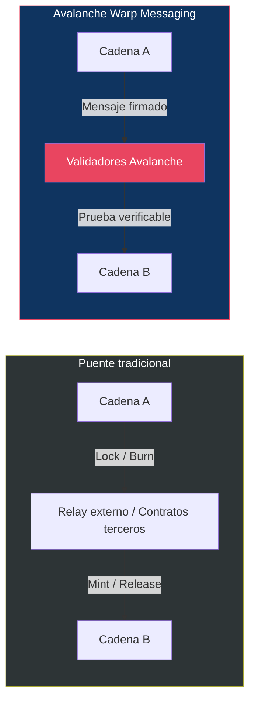
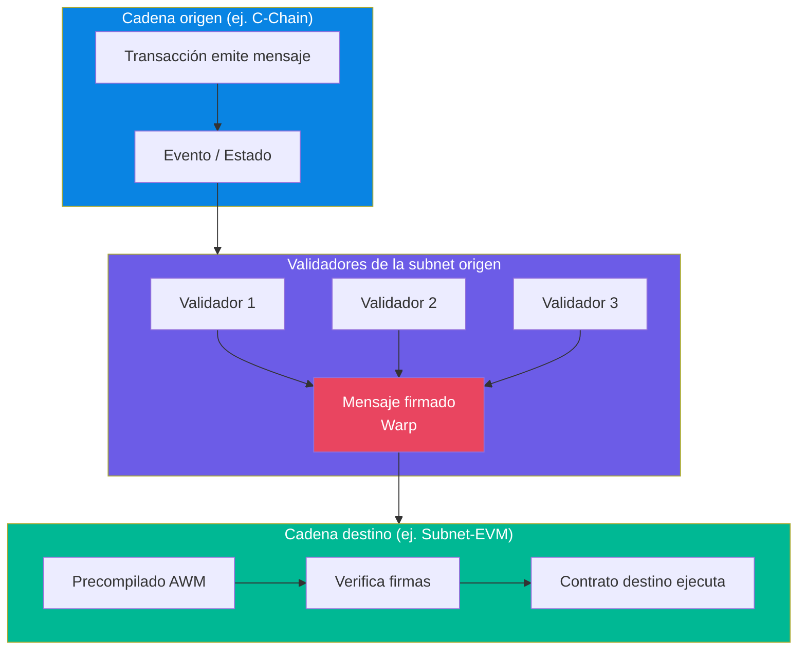
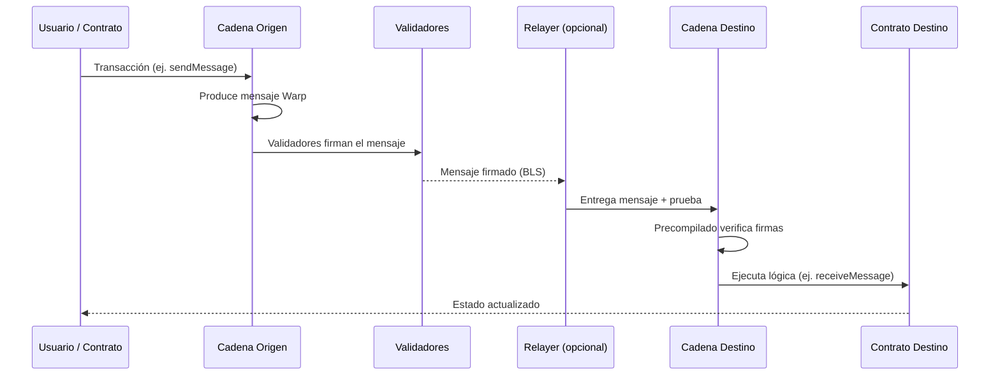
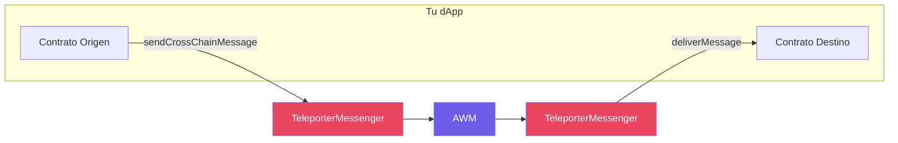
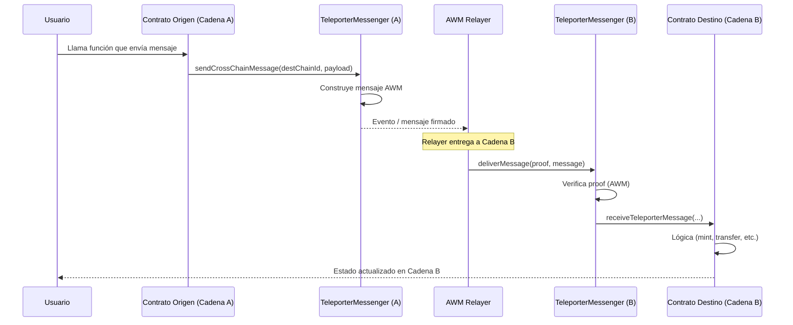
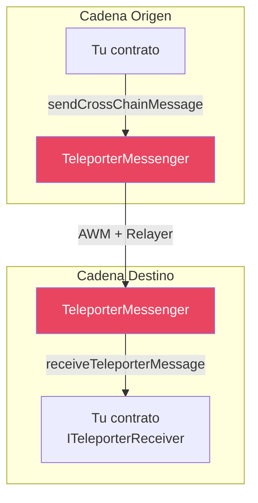
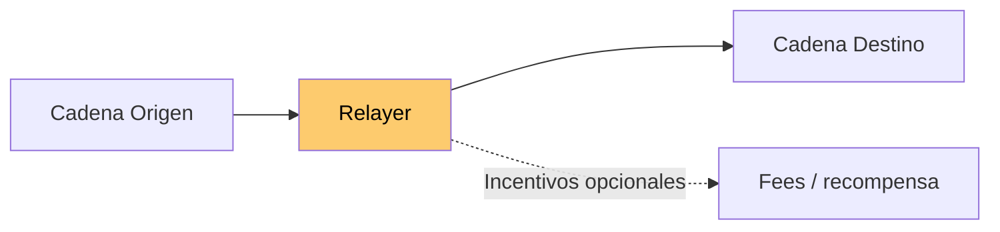
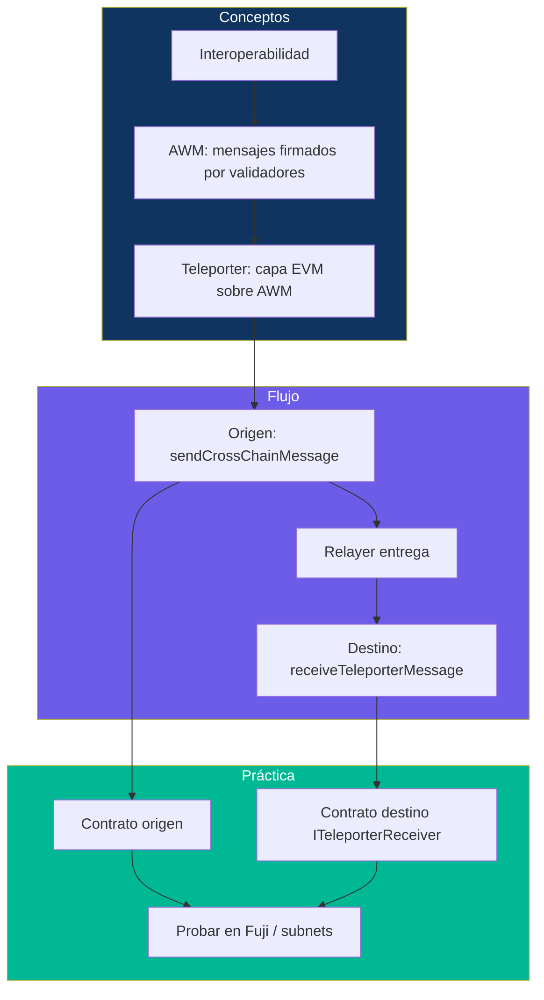

# Semana 2 · Sesión 2 — Teleporter y Avalanche Warp Messaging

**Fecha:** 11 de marzo  
**Instructor:** Andrés Rodriguez  
**Tema:** Interoperabilidad con Teleporter y comunicación Cross-Chain nativa (AWM).

---

## Objetivos de la sesión

- Entender cómo se comunican las cadenas dentro de Avalanche **sin puentes de terceros**.
- Conocer **Avalanche Warp Messaging (AWM)** como capa nativa de mensajería.
- Usar **Teleporter** para enviar mensajes y llamar contratos entre subnets/L1s EVM.

---

## 1. ¿Por qué interoperabilidad?

En un ecosistema con muchas L1s y subnets (C-Chain, tu Subnet-EVM, otras subnets), las dApps a menudo necesitan:

- **Mover valor o datos** de una cadena a otra.
- **Disparar lógica** en otra cadena (ejecutar una función en un contrato remoto).
- **Sincronizar estado** (gobernanza, oráculos, NFTs).

Hay dos enfoques principales:

- **Puente tradicional:** contratos en A y B + un relay (off-chain o multisig) que “escucha” A y “ejecuta” en B. Más complejidad y vectores de ataque.
- **AWM:** los **validadores** firman mensajes; la cadena destino **verifica las firmas** nativamente. No hace falta confiar en un relay externo para la verificación.

---

## 2. Avalanche Warp Messaging (AWM)

### Qué es AWM

**Avalanche Warp Messaging** es el protocolo **nativo** de Avalanche para enviar mensajes entre blockchains (p. ej. C-Chain ↔ tu Subnet-EVM). Las **firmas de los validadores** son la prueba de que el mensaje existió en la cadena origen; la cadena destino tiene un **precompilado** para verificar esas firmas.

### Flujo de datos (alto nivel)

- **Origen:** una transacción crea el “warp message” (incluye source chain ID, payload, etc.).
- **Validadores:** firman el mensaje (BLS); esa firma es la “prueba”.
- **Relayer:** servicio que **entrega** el mensaje a la cadena destino (no necesita confianza para la verificación; la cadena destino solo confía en las firmas).
- **Destino:** el precompilado AWM verifica las firmas; si son válidas, el contrato destino puede ejecutar la lógica (p. ej. mint, transfer, update state).

### Comparación rápida

| Aspecto | Puente tradicional | AWM |
|---------|--------------------|-----|
| Verificación | Relay / multisig / oráculos | Firmas de validadores (on-chain) |
| Confianza | En el operador del bridge | En el consenso de Avalanche |
| Latencia | Depende del relay | Depende del relayer (minutos típicos) |
| Complejidad | Alta (múltiples contratos + off-chain) | Menor (precompilado nativo) |

Documentación: [Avalanche Warp Messaging](https://docs.avax.network/dapps/smart-contracts/avalanche-warp-messaging).

### Imagen de referencia — Builders Hub

<!-- ========== ESPACIO PARA IMAGEN: AWM dataflow ========== -->
<!-- Guardar como ./assets/awm-dataflow.png -->
<!--  -->

| Inserte aquí imagen del Builders Hub (AWM dataflow) | [Builders Hub — AWM Dataflow](https://build.avax.network/academy/interchain-messaging/08-avalanche-warp-messaging/05-dataflow) |
|-----------------------------------------------------|-------------------------------------------------------------------------------------------------------------------------------------|
| Guardar como `./assets/awm-dataflow.png` | *Opcional* |

---

## 3. Teleporter: la capa amigable para dApps

### Qué es Teleporter

**Teleporter** es un **protocolo de mensajería cross-chain** construido **sobre AWM**. Ofrece:

- Contratos estándar (`TeleporterMessenger`) que abstraen la construcción y verificación de mensajes Warp.
- Interfaz para **enviar** mensajes desde un contrato y **recibir** en otro con la interfaz `ITeleporterReceiver`.
- Incentivos para relayers, replay protection y reintentos.

Es la opción recomendada para la mayoría de dApps que necesitan comunicación entre L1s EVM en Avalanche.

### AWM vs Teleporter

| | AWM | Teleporter |
|---|-----|------------|
| **Nivel** | Protocolo base (firmas, precompilado) | Capa de aplicación sobre AWM |
| **Uso** | Cualquier VM que implemente verificación Warp | Contratos EVM (Solidity) |
| **Interfaz** | Manejo manual de mensajes y pruebas | `TeleporterMessenger` + `ITeleporterReceiver` |
| **Casos de uso** | Puentes custom, protocolos de bajo nivel | dApps: puentes de activos, oráculos, gobernanza cross-chain |

### Flujo Teleporter (desde la perspectiva del desarrollador)

### Implementación mínima (conceptos)

**En la cadena origen:** el contrato llama a `TeleporterMessenger.sendCrossChainMessage`:

- Parámetros típicos: `destinationChainID`, `destinationAddress`, `payload` (payload abi-encoded), opciones (fee, etc.).
- El mensaje queda “pendiente” de ser entregado por un relayer.

**En la cadena destino:** el contrato debe implementar `ITeleporterReceiver.receiveTeleporterMessage`:

- Solo el `TeleporterMessenger` puede llamar a esta función (tras verificar la prueba AWM).
- Dentro de `receiveTeleporterMessage` decodificas el payload y ejecutas tu lógica (mint, transfer, update, etc.).

### Casos de uso típicos

- **Puente de activos:** bloqueo en A, mensaje a B, mint o release en B.
- **Gobernanza cross-chain:** voto o propuesta en A, ejecución en B.
- **Oráculos:** datos publicados en A, consumidos por contratos en B.
- **NFTs / mensajes:** “enviar” NFT o mensaje de A a B vía mensaje + lógica en destino.

---

## 4. Relayer: el mensajero (sin confianza para la verificación)

El **AWM Relayer** es un servicio que:

1. **Escucha** mensajes Warp en la cadena origen (eventos o API).
2. **Obtiene** la prueba firmada (BLS) de los validadores.
3. **Envía** una transacción en la cadena destino con el mensaje + prueba.

La cadena destino **no confía en el relayer**: solo verifica las firmas. Si el relayer no entrega, otro relayer puede hacerlo (con incentivos configurables en Teleporter).

Repositorio de referencia: [awm-relayer](https://github.com/ava-labs/awm-relayer).

---

## 5. Resumen visual: Semana 2 Sesión 2

---

## Práctica sugerida

- Revisar un **ejemplo oficial** de contrato que envía/recibe con Teleporter en [ava-labs/teleporter](https://github.com/ava-labs/teleporter).
- Entender el flujo: **emisor → TeleporterMessenger → AWM → relayer → TeleporterMessenger → receptor**.
- Anotar diferencias entre “puente tradicional” y AWM/Teleporter (confianza, verificación, complejidad).
- Comprobar en qué redes está disponible Teleporter (Fuji, mainnet, tu subnet).

---

## Checklist

- [ ] Explicar con tus palabras qué es AWM y qué es Teleporter.
- [ ] Entender el papel del relayer (entrega vs verificación).
- [ ] Haber visto al menos un ejemplo de mensaje cross-chain en la sesión.
- [ ] Saber en qué subnets/RPCs está disponible Teleporter (Fuji, mainnet, custom).

---

## Enlaces útiles

- [Avalanche Warp Messaging — Docs](https://docs.avax.network/dapps/smart-contracts/avalanche-warp-messaging)
- [Builders Hub — AWM Dataflow](https://build.avax.network/academy/interchain-messaging/08-avalanche-warp-messaging/05-dataflow)
- [Teleporter — GitHub](https://github.com/ava-labs/teleporter)
- [Teleporter — Docs / Getting Started](https://docs.avax.network/build/cross-chain/teleporter/overview)
- [Builders Hub — Teleporter](https://build.avax.network/docs/cross-chain/teleporter/getting-started)
- [AWM Relayer — GitHub](https://github.com/ava-labs/awm-relayer)

[← Subnets y Avalanche9000](./01-subnets-avalanche9000.md) · [Volver al índice](../../README.md) · [Siguiente: Frontend y prototipado →](../semana-3/01-frontend-indexacion.md)
