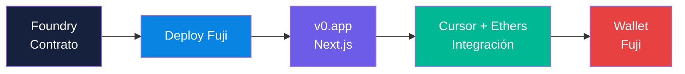
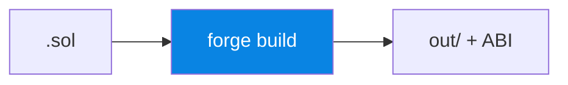
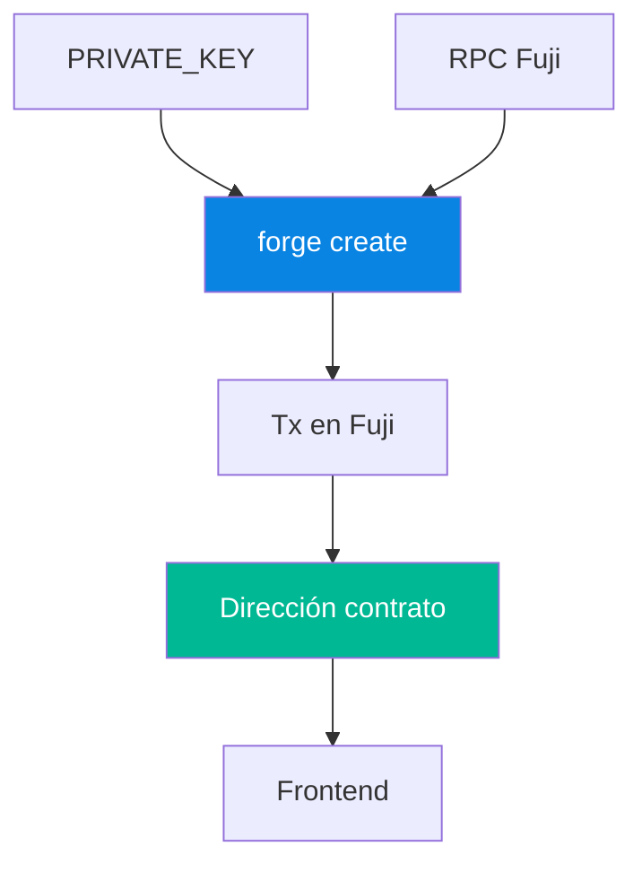
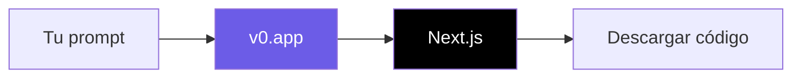
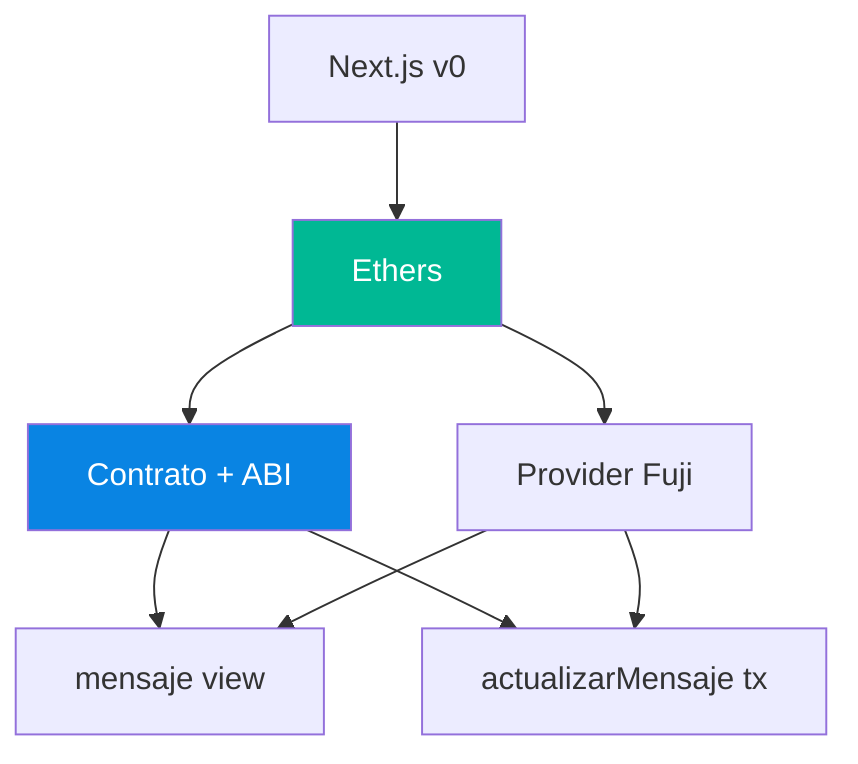
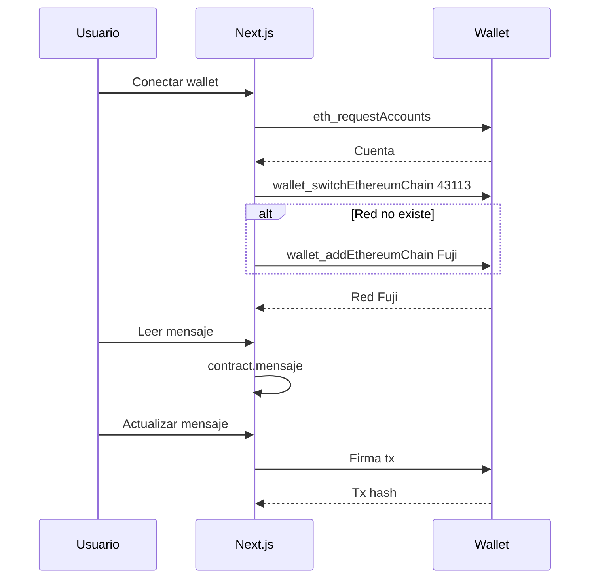
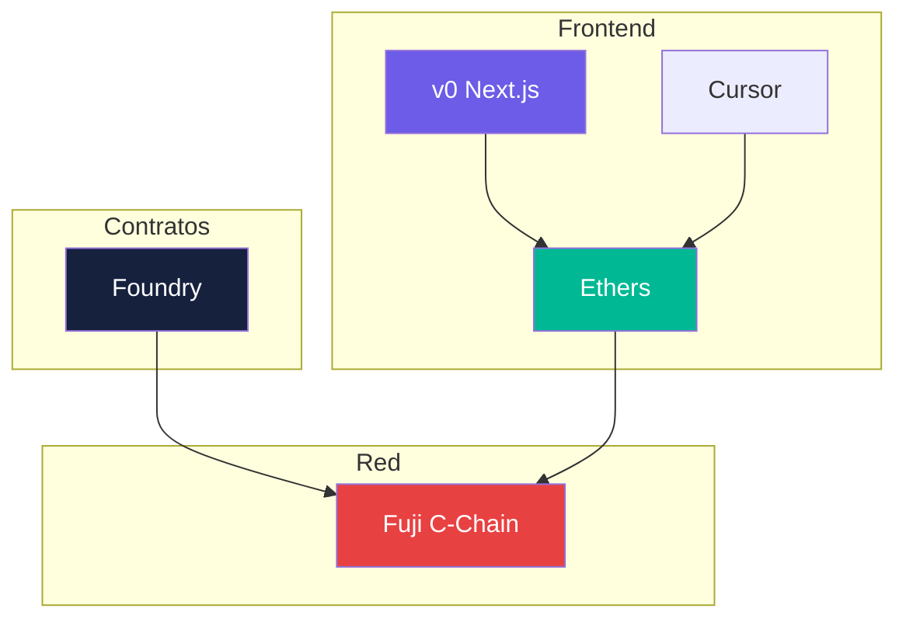
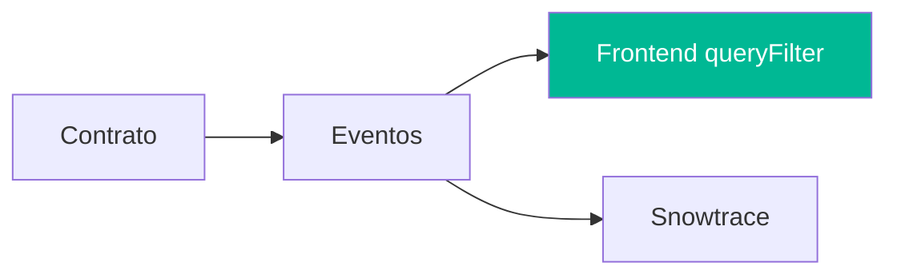

# Semana 3 · Sesión 1 — Frontend, indexación y prototipado

**Fecha:** 16 de marzo  
**Instructor:** Gerardo Vela  
**Tema:** Prototipo con **v0** (Vercel): contrato con Foundry, despliegue en Fuji, frontend generado en **Next.js** con v0 e integración con Ethers (Cursor para conectar wallet y contrato).

---

## Objetivos de la sesión

- Arrancar el **prototipo** con **v0** ([v0.app](https://v0.app/)): contrato en Foundry → desplegar en Fuji → frontend en **Next.js** generado con v0 → añadir integración con Ethers y wallet.
- Usar **v0 by Vercel** para generar la UI (Next.js); **Cursor** para añadir la lógica Web3 (Ethers, dirección del contrato, conexión a Fuji).
- Conectar wallet (Core / MetaMask) y probar lectura/escritura del contrato en Fuji.

---

## 0. Instalación previa (Windows y Mac)

Antes de seguir, necesitas tener instalado: **Node.js** (para el frontend Next.js y npm), **Foundry** (para contratos y deploy) y **Git** (opcional pero recomendado). A continuación los comandos por sistema.

### Node.js (LTS v18 o v20)

| Sistema | Cómo instalar |
|---------|----------------|
| **Mac** | Descargar desde [nodejs.org](https://nodejs.org/) o con Homebrew: `brew install node` |
| **Windows** | Descargar instalador desde [nodejs.org](https://nodejs.org/) o con [nvm-windows](https://github.com/coreybutler/nvm-windows): `nvm install 20` y `nvm use 20` |

Verificar:

```bash
node -v
npm -v
```

### Foundry (forge, cast, anvil)

| Sistema | Comando |
|---------|---------|
| **Mac / Linux** | `curl -L https://foundry.paradigm.xyz \| bash` → cerrar y abrir la terminal → `foundryup` |
| **Windows (PowerShell)** | Ejecutar como administrador: `irm https://win.getfoundry.sh \| iex`; luego `foundryup` |

Si en Windows usas **WSL**, usa los mismos comandos que en Mac/Linux dentro de WSL.

Verificar:

```bash
forge --version
cast --version
```

### Git (opcional)

- **Mac:** `brew install git` o [git-scm.com](https://git-scm.com/)
- **Windows:** Descargar desde [git-scm.com](https://git-scm.com/)

```bash
git --version
```

### Resumen: qué usarás para qué

| Herramienta | Uso en esta sesión |
|-------------|--------------------|
| **Node.js / npm** | Ejecutar el proyecto Next.js que genere v0, instalar Ethers (`npm install ethers`) |
| **Foundry** | Crear contrato, `forge build`, `forge create` para desplegar en Fuji y obtener el ABI |
| **Git** | Clonar/descargar el código de v0 y control de versiones |

Cuando tengas `node -v`, `npm -v` y `forge --version` funcionando, sigue con el flujo de 4 pasos.

---

## 1. Prototipo con v0 — Flujo en 4 pasos

1. **Contrato mínimo** en Foundry (Solidity) y **desplegar a Fuji** con `forge create`.
2. **Frontend con v0:** generar la UI en [v0.app](https://v0.app/) (te da un proyecto **Next.js**). Descargar o clonar el código.
3. **Integrar Web3** en ese Next.js: Ethers.js, dirección del contrato, ABI, y componentes para leer/escribir y conectar wallet. Aquí **Cursor** te ayuda a pegar y adaptar la lógica.
4. **Conectar wallet** (Core / MetaMask) y cambiar a Fuji; probar en vivo.

**v0** es la plataforma de Vercel para crear frontends con IA; el resultado es **Next.js**. Luego tú añades la capa blockchain (Ethers + Fuji + tu contrato).



---

## 2. Paso 1: Contrato mínimo con Foundry

### Inicializar proyecto Foundry

```bash
forge init avax-v0 --no-commit
cd avax-v0
```

### Contrato mínimo (ejemplo)

Crea o edita `src/HolaAvalanche.sol`:

```solidity
// SPDX-License-Identifier: MIT
pragma solidity ^0.8.19;

contract HolaAvalanche {
    string public mensaje = "Hola Avalanche desde CriptoUNAM";

    function actualizarMensaje(string calldata _nuevo) external {
        mensaje = _nuevo;
    }
}
```

Compilar y comprobar:

```bash
forge build
```



---

## 3. Paso 2: Desplegar en Fuji con Foundry

### Variables de entorno

Crea `.env` en la raíz del proyecto (y añade `.env` al `.gitignore`):

```
PRIVATE_KEY=tu_clave_privada_sin_0x
```

### Despliegue con forge create

```bash
forge create src/HolaAvalanche.sol:HolaAvalanche \
  --rpc-url https://api.avax-test.network/ext/bc/C/rpc \
  --private-key $PRIVATE_KEY
```

Anota la **dirección del contrato** que imprime el comando. Verifica la tx en [Fuji Snowtrace](https://testnet.snowtrace.io/).

### (Opcional) Script de deploy

Puedes usar un script para reutilizar el deploy:

```bash
forge script script/Deploy.s.sol --rpc-url https://api.avax-test.network/ext/bc/C/rpc --broadcast --private-key $PRIVATE_KEY
```

Con eso tienes **contrato en Fuji** y dirección lista para el frontend.



---

## 4. Paso 3: Frontend con v0 (Next.js) + integración Ethers

### Generar la UI con v0

- Entra en **[v0.app](https://v0.app/)** (v0 by Vercel).
- Describe la interfaz que quieres (p. ej. “página con título, un texto que muestre un mensaje, un input y un botón para actualizar, y un botón para conectar wallet”).
- v0 te genera un proyecto **Next.js**. Descarga o clona el código en tu máquina.



### Añadir integración con Avalanche (Fuji) y tu contrato

En ese proyecto Next.js:

- Instala Ethers: `npm install ethers`.
- Configura **Fuji**: RPC `https://api.avax-test.network/ext/bc/C/rpc`, Chain ID `43113`.
- Usa la **dirección** del contrato que desplegaste con Foundry y el **ABI** (desde `forge inspect HolaAvalanche abi` o `out/.../HolaAvalanche.json`).

Con **Cursor** (o tu IDE) añade la lógica: provider, contrato (lectura de `mensaje()`), botón para `actualizarMensaje(...)`, y flujo de conexión de wallet + cambio a Fuji. Puedes pedirle a Cursor que genere los componentes o hooks que llamen a las funciones del contrato.

Necesitas la **dirección** del contrato desplegado y el **ABI**. Con Foundry: `forge inspect HolaAvalanche abi` o el campo `abi` en `out/HolaAvalanche.sol/HolaAvalanche.json`.

**Ejemplo de lógica** para pegar en tu Next.js (ajusta `CONTRACT_ADDRESS`):

```javascript
import { ethers } from 'ethers';

const FUJI_RPC = 'https://api.avax-test.network/ext/bc/C/rpc';
const FUJI_CHAIN_ID = 43113;
const CONTRACT_ADDRESS = '0x...'; // la que te dio forge create

const ABI = [
  'function mensaje() view returns (string)',
  'function actualizarMensaje(string)',
];

// Solo lectura
const provider = new ethers.JsonRpcProvider(FUJI_RPC);
const contract = new ethers.Contract(CONTRACT_ADDRESS, ABI, provider);
const mensaje = await contract.mensaje();

// Escritura (con wallet conectada)
const signer = await new ethers.BrowserProvider(window.ethereum).getSigner();
const contractWrite = new ethers.Contract(CONTRACT_ADDRESS, ABI, signer);
const tx = await contractWrite.actualizarMensaje('Nuevo mensaje');
await tx.wait();
```

Sustituye en la UI generada por v0 los textos/datos estáticos por llamadas a `contract.mensaje()` y el botón por `actualizarMensaje(...)` usando el signer de la wallet conectada.



---

## 5. Paso 4: Conectar wallet y cambiar a Fuji

- Llamar `eth_requestAccounts` para conectar.
- Cambiar a Fuji con `wallet_switchEthereumChain` (chainId `43113`); si la red no existe, usar `wallet_addEthereumChain` con el RPC y block explorer de Fuji.

Ejemplo de cambio a Fuji (Ethers v6):

```javascript
await window.ethereum.request({
  method: 'wallet_switchEthereumChain',
  params: [{ chainId: ethers.toQuantity(43113) }],
});
```

Si falla con código 4902, añade la red con `wallet_addEthereumChain` (mismo RPC y [testnet.snowtrace.io](https://testnet.snowtrace.io/) como blockExplorerUrls).



---

## 6. Stack recomendado para el prototipo

| Capa | Recomendado |
|------|-------------|
| **Contratos** | Foundry (escribir, compilar, desplegar) |
| **Frontend** | **v0** ([v0.app](https://v0.app/)) → proyecto **Next.js**; luego integrar Ethers.js |
| **Integración Web3** | Cursor para añadir Ethers, wallet y llamadas al contrato en el código de v0 |
| **Wallet** | Core / MetaMask (window.ethereum) |
| **Red** | Fuji (C-Chain) |



---

## 7. Indexación básica (opcional)

Para listar eventos sin escanear todos los bloques:

- **Eventos con Ethers:** `contract.queryFilter(filter, fromBlock, 'latest')` si tu contrato emite eventos.
- **Snowtrace:** para consultas puntuales (balance, historial).
- **The Graph:** para más adelante cuando necesites queries complejas.



---

## 8. Entregables de esta sesión

- [ ] Proyecto **Foundry** con contrato mínimo y **desplegado en Fuji**.
- [ ] Frontend generado con **v0** (Next.js), con **Ethers** integrado para leer y escribir en ese contrato.
- [ ] **Conectar wallet** y cambio a **Fuji** desde la UI.
- [ ] (Opcional) Usar **Cursor** para añadir o refactorizar la integración Web3 en el código que te da v0.

---

## Checklist técnico

- [ ] Foundry: `forge build` y `forge create` a Fuji con contrato desplegado.
- [ ] Frontend: proyecto **Next.js** (v0) con provider Fuji, contrato (dirección + ABI), lectura (view) y una tx (write).
- [ ] Botón “Conectar wallet” y cambio a red Fuji.
- [ ] Enlace a la tx o contrato en Fuji Snowtrace.

---

## Enlaces útiles

- [v0 by Vercel](https://v0.app/) — Generar frontend en Next.js con IA
- [Cursor](https://cursor.com/) — Integrar Ethers y wallet en el código de v0
- [Foundry Book](https://book.getfoundry.sh/)
- [Ethers.js v6](https://docs.ethers.org/v6/)
- [Core Wallet](https://core.app/)
- [Fuji Snowtrace](https://testnet.snowtrace.io/)

[← Teleporter](../semana-2/02-teleporter-awm.md) · [Volver al índice](../../README.md) · [Siguiente: Lean Canvas y equipos →](./02-lean-canvas-equipos.md)
