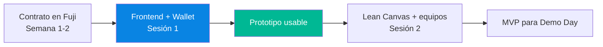
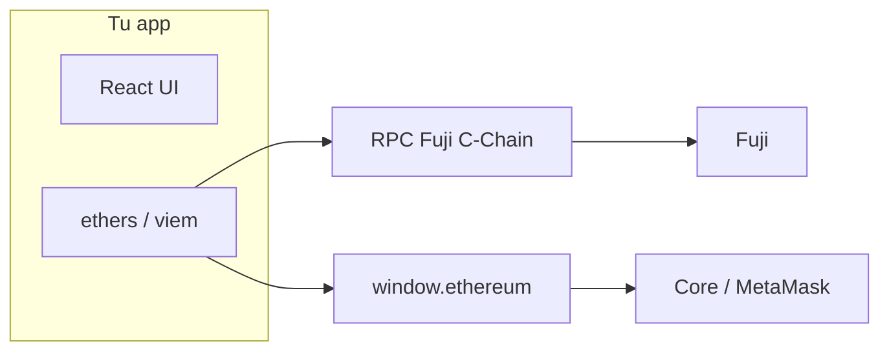
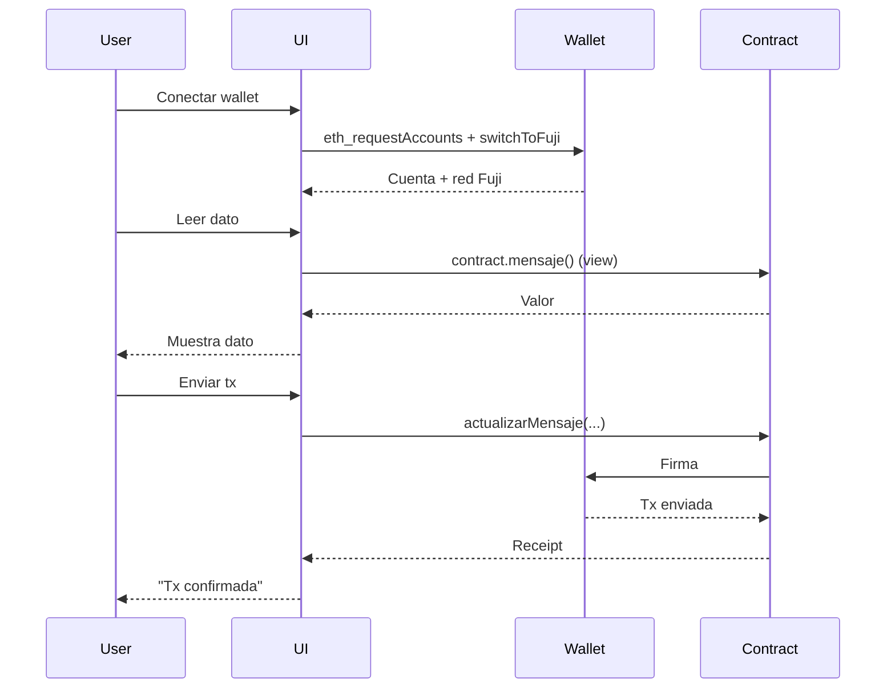

# Semana 3 · Sesión 1 — Frontend, indexación y prototipado

**Fecha:** 16 de marzo  
**Instructor:** Gerardo Vela  
**Tema:** Workshop técnico: frontend (Ethers.js / Viem), conexión a Fuji, indexación básica y **arranque del prototipo** para el MVP.

---

## Objetivos de la sesión

- Montar un **frontend mínimo** conectado a la C-Chain (Fuji) y empezar el prototipo del MVP.
- Usar **Ethers.js** o **Viem** para leer y escribir en contratos ya desplegados.
- Implementar **conexión de wallet** (Core / MetaMask) y cambio a red Fuji.
- Conocer opciones de **indexación** (eventos, Snowtrace, The Graph) para mejorar la UX del prototipo.

---

## Por qué esta sesión va primero

En la Semana 3 priorizamos **construir**: primero tienes un prototipo técnico funcionando (contrato + frontend en Fuji) y después alineas modelo de negocio y equipos (Sesión 2). Así el Lean Canvas y los roles se apoyan en algo tangible.



---

## 1. Stack recomendado para el prototipo

| Capa | Opción A | Opción B |
|------|----------|----------|
| **Framework** | React + Vite | Next.js |
| **Librería blockchain** | Ethers.js v6 | Viem |
| **Wallet** | Core / MetaMask (window.ethereum) | Wagmi + RainbowKit (opcional) |
| **Red** | Fuji (C-Chain) | Fuji + tu L1 (si aplica) |

Para avanzar rápido, **React + Vite + Ethers** (o Viem) es suficiente. Wagmi/RainbowKit puedes añadirlos después si quieres mejor UX de conexión.

---

## 2. Crear el proyecto e instalar dependencias

### React + Vite

```bash
npm create vite@latest mi-dapp-avax -- --template react
cd mi-dapp-avax
npm install
npm install ethers
```

### Añadir Fuji a la app

Necesitas el **Chain ID** (`43113`) y el **RPC** de Fuji C-Chain:

```
https://api.avax-test.network/ext/bc/C/rpc
```



---

## 3. Provider y conexión a Fuji

### Ethers v6 — Provider y Signer

```javascript
import { ethers } from 'ethers';

const FUJI_RPC = 'https://api.avax-test.network/ext/bc/C/rpc';
const FUJI_CHAIN_ID = 43113;

// Solo lectura (sin wallet)
export const provider = new ethers.JsonRpcProvider(FUJI_RPC);

// Con wallet (para firmar txs)
export async function getSigner() {
  if (!window.ethereum) throw new Error('Instala Core o MetaMask');
  await window.ethereum.request({ method: 'eth_requestAccounts' });
  await switchToFuji();
  const providerWallet = new ethers.BrowserProvider(window.ethereum);
  return providerWallet.getSigner();
}

async function switchToFuji() {
  try {
    await window.ethereum.request({
      method: 'wallet_switchEthereumChain',
      params: [{ chainId: ethers.toQuantity(FUJI_CHAIN_ID) }],
    });
  } catch (e) {
    if (e.code === 4902) {
      await window.ethereum.request({
        method: 'wallet_addEthereumChain',
        params: [{
          chainId: ethers.toQuantity(FUJI_CHAIN_ID),
          chainName: 'Avalanche Fuji',
          nativeCurrency: { name: 'AVAX', symbol: 'AVAX', decimals: 18 },
          rpcUrls: [FUJI_RPC],
          blockExplorerUrls: ['https://testnet.snowtrace.io/'],
        }],
      });
    } else throw e;
  }
}
```

### Viem (alternativa)

```javascript
import { createPublicClient, createWalletClient, http, custom } from 'viem';
import { avalancheFuji } from 'viem/chains';

const transport = typeof window !== 'undefined'
  ? custom(window.ethereum)
  : http('https://api.avax-test.network/ext/bc/C/rpc');

export const publicClient = createPublicClient({
  chain: avalancheFuji,
  transport: http('https://api.avax-test.network/ext/bc/C/rpc'),
});

export const walletClient = createWalletClient({
  chain: avalancheFuji,
  transport: custom(window.ethereum),
});
```

---

## 4. Leer y escribir en tu contrato

Usas el **ABI** y la **dirección** del contrato que desplegaste en Semana 1 (o cualquier contrato en Fuji).

### Lectura (view) — sin wallet

```javascript
import { ethers } from 'ethers';

const CONTRACT_ADDRESS = '0x...'; // tu contrato en Fuji
const ABI = ['function mensaje() view returns (string)'];

const provider = new ethers.JsonRpcProvider(FUJI_RPC);
const contract = new ethers.Contract(CONTRACT_ADDRESS, ABI, provider);
const mensaje = await contract.mensaje();
console.log(mensaje);
```

### Escritura (tx) — con wallet

```javascript
const signer = await getSigner();
const contractWrite = new ethers.Contract(CONTRACT_ADDRESS, ABI, signer);
const tx = await contractWrite.actualizarMensaje('Nuevo mensaje desde el prototipo');
await tx.wait();
console.log('Tx confirmada:', tx.hash);
```

### Flujo en el prototipo



---

## 5. Conectar wallet en la UI

- **Conectar:** llamar `eth_requestAccounts` y luego `wallet_switchEthereumChain` a Fuji (o `wallet_addEthereumChain` si no tiene la red).
- **Desconectar:** en un prototipo suele bastar con limpiar estado (cuenta = null).
- **Cuenta y red:** guardar en estado (React `useState`) la dirección y el chainId; escuchar `accountsChanged` y `chainChanged` para actualizar la UI.

Ejemplo mínimo de estado:

```javascript
const [account, setAccount] = useState(null);
const [chainId, setChainId] = useState(null);

useEffect(() => {
  if (!window.ethereum) return;
  window.ethereum.on('accountsChanged', (accounts) => setAccount(accounts[0] ?? null));
  window.ethereum.on('chainChanged', (id) => setChainId(Number(id)));
}, []);
```

---

## 6. Indexación básica para el prototipo

Para no escanear todos los bloques, puedes:

| Enfoque | Cuándo usarlo |
|---------|----------------|
| **Eventos recientes (ethers)** | MVP: listar últimas N transacciones o eventos de tu contrato. |
| **Snowtrace / API** | Consultas puntuales (balance, historial de una dirección). |
| **The Graph** | Cuando necesites queries complejas o muchos eventos (más adelante). |

### Eventos con Ethers (suficiente para empezar)

```javascript
const filter = contract.filters.MensajeActualizado(); // si tu contrato emite ese evento
const fromBlock = 0; // o block actual - 1000
const events = await contract.queryFilter(filter, fromBlock, 'latest');
```

Con eso ya puedes mostrar una lista de “últimas actualizaciones” en el prototipo.

---

## 7. Entregables de esta sesión (prototipo mínimo)

- [ ] Proyecto **React + Vite** (o Next) con **Ethers** o **Viem**.
- [ ] **Conectar wallet** y cambio a **Fuji** desde la UI.
- [ ] **Leer** al menos un valor de un contrato desplegado en Fuji (view).
- [ ] **Enviar** al menos una transacción (write) desde la UI y verla en [Fuji Snowtrace](https://testnet.snowtrace.io/).
- [ ] (Opcional) Listar **eventos recientes** del contrato en la pantalla.

Con esto tienes el **primer prototipo** listo para la Sesión 2, donde alinearás equipo, Lean Canvas y alcance del MVP para el Demo Day.

---

## Checklist técnico

- [ ] Repo del frontend creado y dependencias instaladas.
- [ ] Provider apuntando a Fuji C-Chain.
- [ ] Botón “Conectar wallet” y detección de red (Fuji).
- [ ] Lectura de un contrato (dirección + ABI).
- [ ] Una acción que envíe una tx (ej. actualizar mensaje) y muestre el hash o enlace a Snowtrace.

---

## Enlaces útiles

- [Ethers.js v6](https://docs.ethers.org/v6/)
- [Viem](https://viem.sh/) · [Viem — Avalanche chains](https://viem.sh/docs/chains.html)
- [Core — Add to Wallet](https://docs.core.app/core-extension/add-to-core/)
- [Fuji Snowtrace](https://testnet.snowtrace.io/)
- [The Graph — Avalanche](https://thegraph.com/docs/en/supported-networks/avalanche/)

[← Teleporter](../semana-2/02-teleporter-awm.md) · [Volver al índice](../../README.md) · [Siguiente: Lean Canvas y equipos →](./02-lean-canvas-equipos.md)
