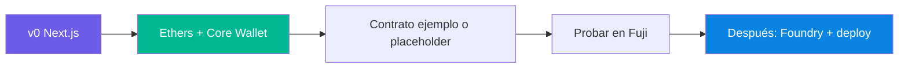
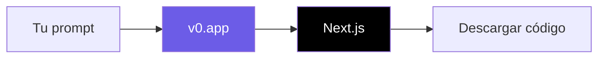
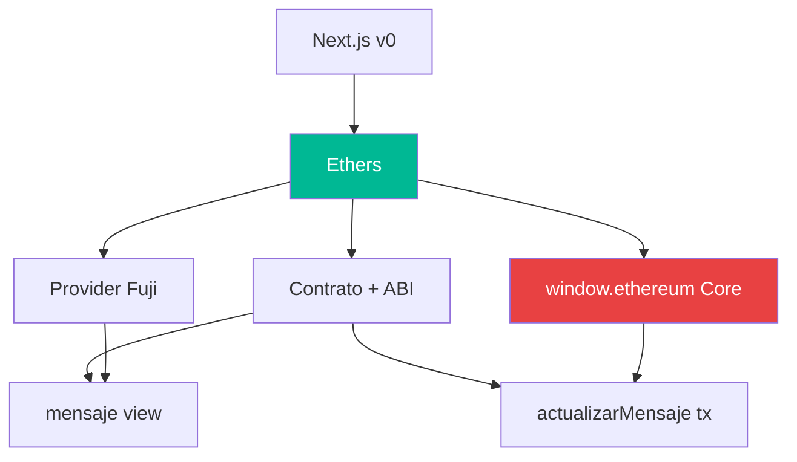
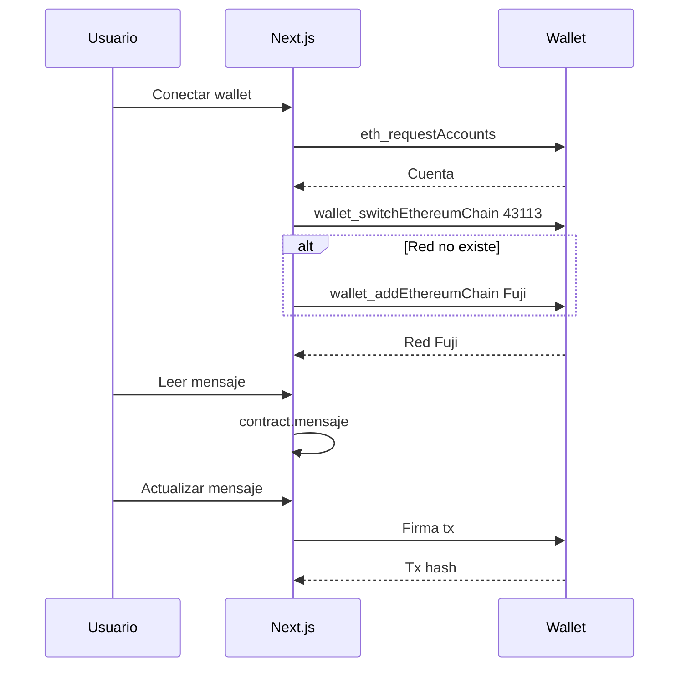
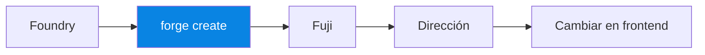
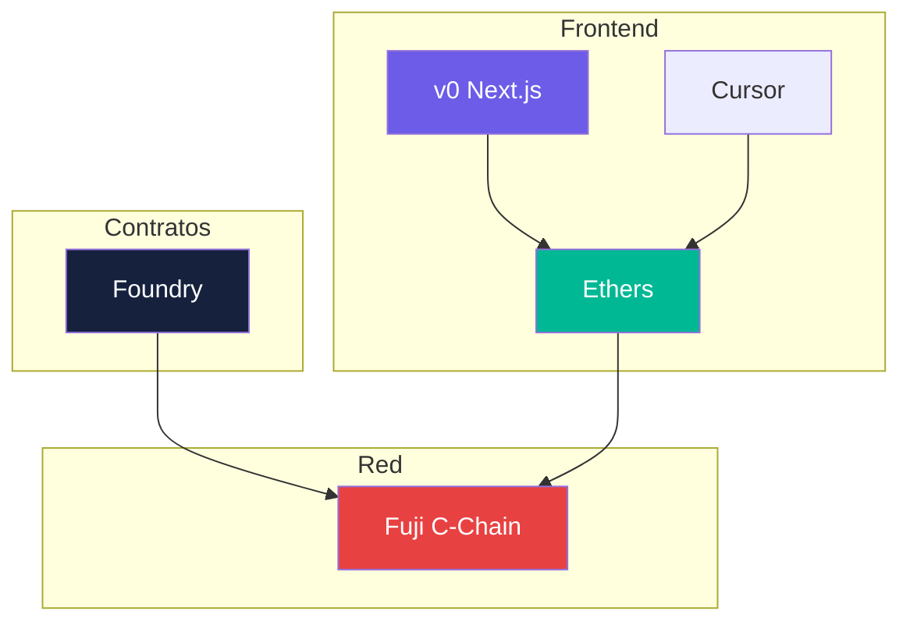
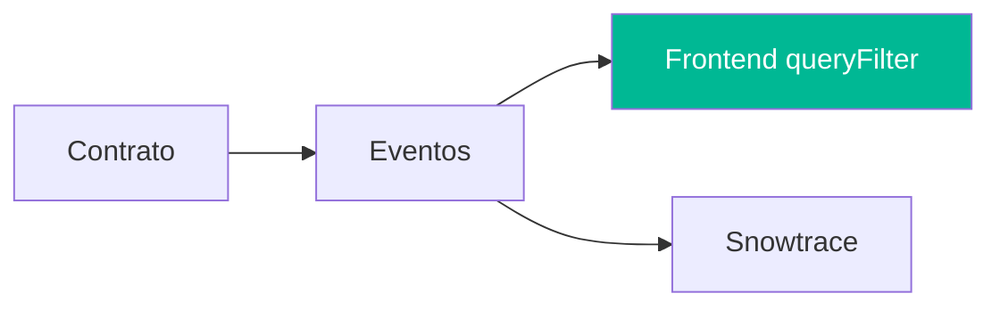

# Semana 3 · Sesión 1 — Frontend, indexación y prototipado

**Fecha:** 16 de marzo  
**Instructor:** Gerardo Vela  
**Tema:** Prototipo con **v0** (Vercel): **frontend primero** (Next.js + Ethers + Core Wallet), luego contrato con Foundry y despliegue en Fuji.

---

## Objetivos de la sesión

- **Frontend primero:** en ~2 h tener la UI (v0 + Next.js) conectada a Fuji, con **Core Wallet** como provider, leyendo y escribiendo en un contrato (de ejemplo o el tuyo).
- Después, si da tiempo o en casa: contrato en Foundry, desplegar en Fuji y cambiar la dirección en el frontend.
- Así nadie se queda sin ver la dApp funcionando aunque el deploy tarde más.

---

## 0. Instalación previa (Windows y Mac)

Antes de seguir, necesitas tener instalado: **Node.js** (para el frontend Next.js y npm), **Foundry** (para contratos y deploy) y **Git** (opcional pero recomendado). A continuación los comandos por sistema.

### Node.js (LTS v18 o v20)

| Sistema | Cómo instalar |
|---------|----------------|
| **Mac** | Descargar desde [nodejs.org](https://nodejs.org/) o con Homebrew: `brew install node` |
| **Windows** | Descargar instalador desde [nodejs.org](https://nodejs.org/) o con [nvm-windows](https://github.com/coreybutler/nvm-windows): `nvm install 20` y `nvm use 20` |

Verificar:

```bash
node -v
npm -v
```

### Foundry (forge, cast, anvil)

| Sistema | Comando |
|---------|---------|
| **Mac / Linux** | `curl -L https://foundry.paradigm.xyz \| bash` → cerrar y abrir la terminal → `foundryup` |
| **Windows (PowerShell)** | Ejecutar como administrador: `irm https://win.getfoundry.sh \| iex`; luego `foundryup` |

Si en Windows usas **WSL**, usa los mismos comandos que en Mac/Linux dentro de WSL.

Verificar:

```bash
forge --version
cast --version
```

### Git (opcional)

- **Mac:** `brew install git` o [git-scm.com](https://git-scm.com/)
- **Windows:** Descargar desde [git-scm.com](https://git-scm.com/)

```bash
git --version
```

### Resumen: qué usarás para qué

| Herramienta | Uso en esta sesión |
|-------------|--------------------|
| **Node.js / npm** | Ejecutar el proyecto Next.js que genere v0, instalar Ethers (`npm install ethers`) |
| **Foundry** | Después del frontend: crear y desplegar tu contrato en Fuji; luego solo cambias la dirección en el frontend |

Cuando tengas `node -v`, `npm -v` (y opcionalmente `forge --version`) funcionando, sigue con el flujo. **Para la sesión en vivo basta con Node/npm** si priorizas el frontend.

---

## 1. Prototipo con v0 — Orden recomendado: frontend primero

1. **Frontend con v0:** generar la UI en [v0.app](https://v0.app/) (Next.js) y descargar el código.
2. **Integrar Web3** en ese Next.js: Ethers, **Core Wallet** (o MetaMask) como provider vía `window.ethereum`, y un **contrato de ejemplo** ya desplegado en Fuji (el instructor puede dar una dirección) o una dirección placeholder para ver la UI.
3. **Conectar wallet** y cambiar a Fuji; probar lectura (y escritura si usas contrato de ejemplo).
4. **Después** (en sesión si da tiempo o en casa): contrato en Foundry, `forge create` en Fuji, y en el frontend solo cambias la dirección del contrato y el ABI.

Así en ~2 h todos ven la dApp conectada y funcionando; el deploy del contrato no bloquea.



---

## 2. Paso 1: Frontend con v0 (Next.js) + integración Ethers

### Generar la UI con v0

- Entra en **[v0.app](https://v0.app/)** (v0 by Vercel).
- Describe la interfaz (p. ej. “página con título, texto que muestre un mensaje, input y botón para actualizar, y botón para conectar wallet”).
- v0 te da un proyecto **Next.js**. Descarga o clona el código en tu máquina.



### Core Wallet como provider

**Sí, puedes usar Core Wallet como provider.** Core inyecta `window.ethereum` igual que MetaMask, así que el código es el mismo:

```javascript
// Con Core Wallet (o MetaMask) instalado en el navegador
const provider = new ethers.BrowserProvider(window.ethereum);
const signer = await provider.getSigner();
```

- **Solo lectura** (sin wallet): usa `new ethers.JsonRpcProvider(FUJI_RPC)`.
- **Para firmar txs** (conectar wallet, enviar `actualizarMensaje`): usa `window.ethereum` → Core o MetaMask se abrirá para conectar y firmar.

Asegúrate de tener **Fuji** agregada en Core (o MetaMask) y AVAX de prueba en C-Chain desde un [faucet](https://core.app/tools/testnet-faucet).

### Añadir integración con Fuji y un contrato

- Instala Ethers: `npm install ethers`.
- Configura **Fuji**: RPC `https://api.avax-test.network/ext/bc/C/rpc`, Chain ID `43113`.
- **Contrato de ejemplo:** el instructor puede compartir una **dirección** y el **ABI** de un contrato ya desplegado en Fuji (por ejemplo `HolaAvalanche`). Usas esa dirección en el frontend y ya puedes leer y escribir sin desplegar nada tú.
- **Si no hay contrato de ejemplo:** usa una dirección placeholder (p. ej. `0x0000000000000000000000000000000000000000`) y solo implementa el botón “Conectar wallet” y el cambio a Fuji; cuando despliegues tu contrato, cambias la constante por la dirección real.

Con **Cursor** añade la lógica: provider (RPC para lectura, `window.ethereum` para firmar), contrato con dirección + ABI, y componentes para conectar wallet y cambiar a Fuji.

**Ejemplo de lógica** para pegar en tu Next.js. Usa la dirección del **contrato de ejemplo** que dé el instructor, o una placeholder hasta que despliegues el tuyo:

```javascript
import { ethers } from 'ethers';

const FUJI_RPC = 'https://api.avax-test.network/ext/bc/C/rpc';
const FUJI_CHAIN_ID = 43113;
const CONTRACT_ADDRESS = '0x...'; // contrato de ejemplo o el tuyo después del deploy

const ABI = [
  'function mensaje() view returns (string)',
  'function actualizarMensaje(string)',
];

// Solo lectura (sin wallet)
const provider = new ethers.JsonRpcProvider(FUJI_RPC);
const contract = new ethers.Contract(CONTRACT_ADDRESS, ABI, provider);
const mensaje = await contract.mensaje();

// Escritura: Core Wallet (o MetaMask) como provider
const walletProvider = new ethers.BrowserProvider(window.ethereum);
const signer = await walletProvider.getSigner();
const contractWrite = new ethers.Contract(CONTRACT_ADDRESS, ABI, signer);
const tx = await contractWrite.actualizarMensaje('Nuevo mensaje');
await tx.wait();
```

Sustituye en la UI generada por v0 los textos estáticos por `contract.mensaje()` y el botón por `actualizarMensaje(...)` usando el signer de **Core Wallet** (o MetaMask).



---

## 3. Paso 2: Conectar wallet (Core) y cambiar a Fuji

- Llamar `eth_requestAccounts` para conectar (Core o MetaMask).
- Cambiar a Fuji con `wallet_switchEthereumChain` (chainId `43113`); si la red no existe, usar `wallet_addEthereumChain` con el RPC y block explorer de Fuji.

Ejemplo de cambio a Fuji (Ethers v6):

```javascript
await window.ethereum.request({
  method: 'wallet_switchEthereumChain',
  params: [{ chainId: ethers.toQuantity(43113) }],
});
```

Si falla con código 4902, añade la red con `wallet_addEthereumChain` (mismo RPC y [testnet.snowtrace.io](https://testnet.snowtrace.io/) como blockExplorerUrls).



---

## 4. Paso 3: Contrato con Foundry y deploy en Fuji (después del frontend)

Cuando el frontend ya conecta y usa un contrato de ejemplo (o placeholder), puedes **desplegar tu propio contrato** y solo cambiar la dirección en el frontend.

### Inicializar proyecto Foundry

```bash
forge init avax-v0 --no-commit
cd avax-v0
```

### Contrato mínimo (ejemplo)

Crea o edita `src/HolaAvalanche.sol`:

```solidity
// SPDX-License-Identifier: MIT
pragma solidity ^0.8.19;

contract HolaAvalanche {
    string public mensaje = "Hola Avalanche desde CriptoUNAM";

    function actualizarMensaje(string calldata _nuevo) external {
        mensaje = _nuevo;
    }
}
```

```bash
forge build
```

### Desplegar en Fuji

Crea `.env` con `PRIVATE_KEY=tu_clave_sin_0x` (y añade `.env` al `.gitignore`).

```bash
forge create src/HolaAvalanche.sol:HolaAvalanche \
  --rpc-url https://api.avax-test.network/ext/bc/C/rpc \
  --private-key $PRIVATE_KEY
```

Anota la **dirección** que imprime el comando. En tu frontend Next.js cambia `CONTRACT_ADDRESS` por esa dirección (el ABI: `forge inspect HolaAvalanche abi` o el JSON en `out/`). Verifica la tx en [Fuji Snowtrace](https://testnet.snowtrace.io/).



---

## 5. Stack recomendado para el prototipo

| Capa | Recomendado |
|------|-------------|
| **Contratos** | Foundry (escribir, compilar, desplegar) |
| **Frontend** | **v0** ([v0.app](https://v0.app/)) → proyecto **Next.js**; luego integrar Ethers.js |
| **Integración Web3** | Cursor para añadir Ethers, wallet y llamadas al contrato en el código de v0 |
| **Wallet** | **Core Wallet** o MetaMask (window.ethereum como provider) |
| **Red** | Fuji (C-Chain) |



---

## 6. Subir a Vercel (URL público)

Para tener una **URL pública** de tu dApp (ideal para compartir en el Demo Day), despliega el proyecto Next.js en **Vercel**. Es gratuito y se integra bien con proyectos que vienen de v0.

### Opción A: Conectar repositorio en vercel.com

1. Sube tu proyecto Next.js a **GitHub** (crea un repo y haz `git push`).
2. Entra en [vercel.com](https://vercel.com) e inicia sesión (con GitHub).
3. **Add New** → **Project** → importa el repositorio de tu frontend.
4. Vercel detecta Next.js; deja los ajustes por defecto y haz **Deploy**.
5. En unos minutos tendrás una URL como `tu-proyecto.vercel.app`. Cada `git push` a la rama principal puede configurarse para redesplegar solo.

### Opción B: Vercel CLI

```bash
npm i -g vercel
cd tu-proyecto-nextjs
vercel
```

Sigue las preguntas (login si hace falta, nombre del proyecto). Al final te dará la URL de despliegue.

### Variables de entorno (si las usas)

Si en el código tienes la dirección del contrato o el RPC en variables de entorno (p. ej. `NEXT_PUBLIC_CONTRACT_ADDRESS`), en Vercel:

- **Project** → **Settings** → **Environment Variables**.
- Añade cada variable (ej. `NEXT_PUBLIC_CONTRACT_ADDRESS`, `NEXT_PUBLIC_FUJI_RPC`).
- Solo las que empiezan con `NEXT_PUBLIC_` estarán disponibles en el navegador en Next.js.

Vuelve a desplegar después de cambiar variables para que se apliquen.

### Resumen

| Paso | Acción |
|------|--------|
| 1 | Código en GitHub (o usar CLI) |
| 2 | vercel.com → Import repo (o `vercel` en la terminal) |
| 3 | Deploy → obtienes `https://tu-app.vercel.app` |
| 4 | (Opcional) Añadir env vars y redesplegar |

Con la URL pública puedes compartir el enlace en el Demo Day y que el panel (o cualquiera) abra la dApp, conecte Core Wallet y pruebe en Fuji.

---

## 7. Indexación básica (opcional)

Para listar eventos sin escanear todos los bloques:

- **Eventos con Ethers:** `contract.queryFilter(filter, fromBlock, 'latest')` si tu contrato emite eventos.
- **Snowtrace:** para consultas puntuales (balance, historial).
- **The Graph:** para más adelante cuando necesites queries complejas.



---

## 8. Entregables de esta sesión

- [ ] Frontend **v0** (Next.js) con **Ethers** y **Core Wallet** (o MetaMask), leyendo y escribiendo en un contrato (ejemplo o el tuyo).
- [ ] **Conectar wallet** y cambio a **Fuji** desde la UI.
- [ ] (Si da tiempo) **Foundry**: contrato desplegado en Fuji y dirección actualizada en el frontend.
- [ ] (Opcional) **Vercel**: frontend desplegado y URL público para compartir en el Demo Day.

---

## Checklist técnico

- [ ] Frontend: **Next.js** (v0) con Ethers, **Core Wallet** como provider, contrato (dirección ejemplo o tuya), lectura (view) y una tx (write).
- [ ] Botón “Conectar wallet” y cambio a red Fuji.
- [ ] (Opcional) Contrato propio desplegado en Fuji y dirección actualizada en el frontend.
- [ ] (Opcional) App desplegada en Vercel con URL público.

---

## Enlaces útiles

- [v0 by Vercel](https://v0.app/) — Generar frontend en Next.js con IA
- [Cursor](https://cursor.com/) — Integrar Ethers y wallet en el código de v0
- [Foundry Book](https://book.getfoundry.sh/)
- [Ethers.js v6](https://docs.ethers.org/v6/)
- [Core Wallet](https://core.app/)
- [Fuji Snowtrace](https://testnet.snowtrace.io/)
- [Vercel](https://vercel.com) — Desplegar Next.js y obtener URL público

[← Teleporter](../semana-2/02-teleporter-awm.md) · [Volver al índice](../../README.md) · [Siguiente: Lean Canvas y equipos →](./02-lean-canvas-equipos.md)
