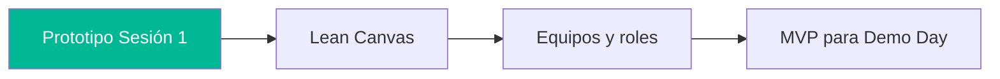

# Semana 3 · Sesión 2 — Lean Canvas y formación de equipos

**Fecha:** 18 de marzo  
**Instructor:** Gerardo Vela  
**Tema:** Diseño de modelos de negocio Web3, Lean Canvas y formación de equipos con mentores. Alinear el **prototipo** de la Sesión 1 con propuesta de valor y alcance del MVP.

---

## Objetivos de la sesión

- Aterrizar tu idea en un **modelo de negocio** claro (Lean Canvas adaptado a Web3).
- Formar o afinar **equipos** con roles definidos.
- Alinear el **prototipo técnico** (frontend + contrato en Fuji) con la propuesta de valor y el alcance del MVP para el Demo Day.

---

## Contexto: ya tienes un prototipo

En la **Sesión 1** montaste un frontend conectado a Fuji, lectura/escritura de contrato y conexión de wallet. En esta sesión damos marco de negocio y equipo a ese prototipo:

---

## 1. Modelos de negocio Web3

- **Tokenomics:** utilidad del token, distribución, incentivos.
- **Valor en la red:** descentralización, gobernanza, datos on-chain.
- **Monetización:** fees, premium, grants, ecosistema.
- **Diferencias con Web2:** ownership, composabilidad, permisos.

---

## 2. Lean Canvas (adaptado a Web3)

| Bloque | Pregunta clave |
|--------|-----------------|
| **Problema** | ¿Qué dolor o necesidad resuelves? |
| **Usuarios objetivo** | ¿Quiénes son (persona/rol en Web3)? |
| **Propuesta de valor** | ¿Por qué tu solución y no otra? |
| **Solución** | ¿Qué producto/MVP mínimo lo demuestra? *(aquí encaja tu prototipo)* |
| **Canales** | ¿Cómo llegas a usuarios (comunidad, grants, partners)? |
| **Métricas** | ¿Qué medirás (TVL, usuarios, transacciones)? |
| **Ventaja** | ¿Qué es difícil de copiar (tech, comunidad, datos)? |
| **Costes** | ¿Qué gastas (dev, marketing, infra)? |
| **Ingresos** | ¿De dónde viene el flujo (fees, token, grants)? |

Llenar al menos una versión por equipo; la **Solución** debe ser coherente con lo que ya construiste en la Sesión 1 (o el siguiente paso claro del prototipo).

---

## 3. Formación de equipos

- Definir **rol por persona:** frontend, contratos, producto, diseño, negocio.
- Objetivo común: **MVP demostrable** en el Demo Day (Semana 4), apoyado en el prototipo actual.
- Aprovechar mentores para validar idea y alcance del MVP.

---

## Entregables sugeridos

- [ ] **Lean Canvas** (borrador) del proyecto.
- [ ] **Equipo** definido con roles y repo compartido (si aplica).
- [ ] Una frase: *“En el Demo Day vamos a mostrar…”* alineada con el prototipo técnico.

---

## Enlaces útiles

- [Lean Canvas (original)](https://leanstack.com/lean-canvas)
- [Tokenomics design](https://docs.avax.network/learn/platform-overview/tokenomics) — contexto Avalanche

[← Frontend y prototipado](./01-frontend-indexacion.md) · [Volver al índice](../../README.md) · [Siguiente: Seguridad y QA →](../semana-4/01-seguridad-qa.md)
