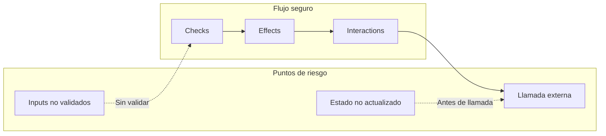
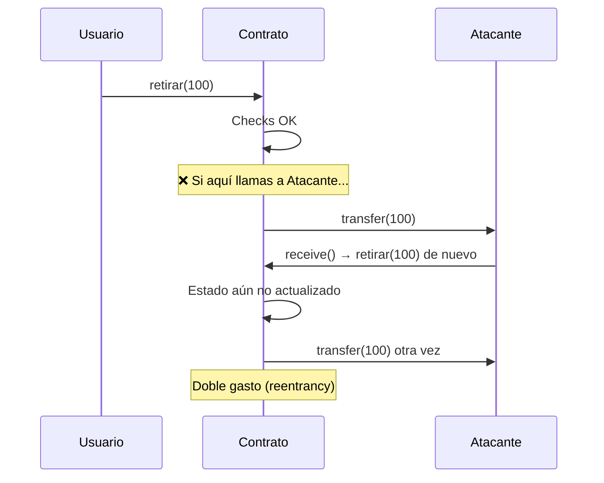
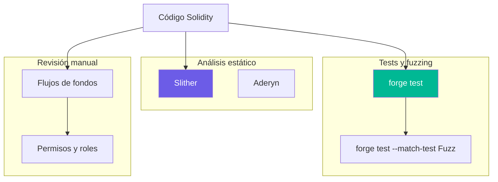
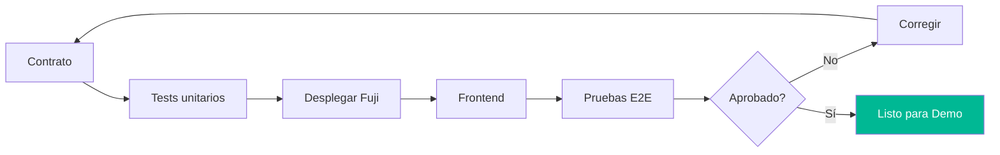
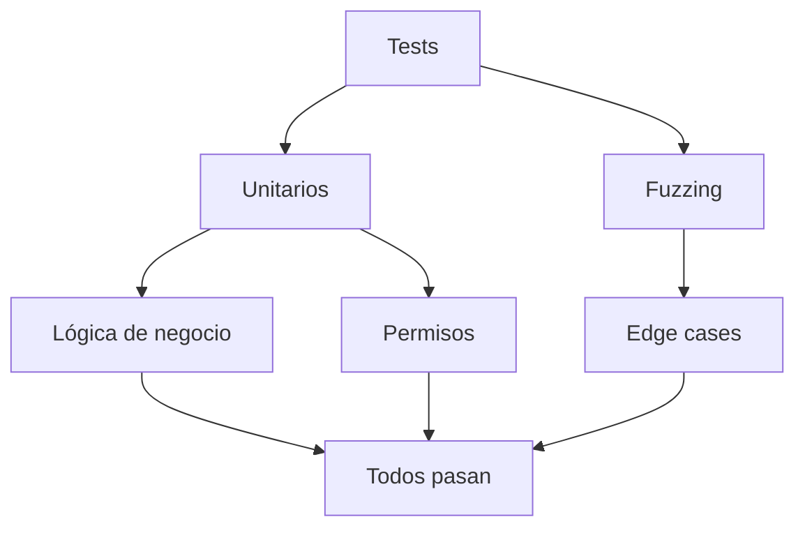
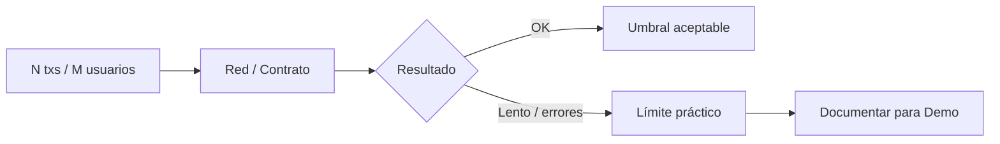
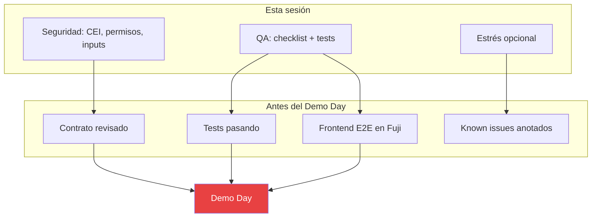

# Semana 4 · Sesión 1 — Seguridad y QA

**Fecha:** 23 de marzo  
**Instructor:** Gerardo Vela  
**Tema:** Iteración técnica, QA, pruebas de estrés y seguridad básica en contratos inteligentes. Dejar el MVP listo para el Demo Day.

---

## Objetivos de la sesión

- Revisar **buenas prácticas de seguridad** en Solidity y aplicarlas a tu MVP.
- Definir un **QA claro** (checklist funcional + tests automatizados) y usarlo en la iteración.
- Conocer **pruebas de estrés** y cómo interpretar límites del sistema y de la red.
- Dejar contrato(s), frontend y flujo probados de punta a punta para la presentación del Demo Day.

---

## 1. Seguridad básica en contratos

### Flujo de valor y puntos de riesgo

Cualquier función que **reciba valor** (ETH/AVAX) o **llame a direcciones externas** (usuarios, otros contratos) es un punto de entrada para ataques. El objetivo es **validar primero**, **actualizar estado después** y **llamar al exterior al final**.



### Patrón Checks-Effects-Interactions (CEI)

1. **Checks:** validar condiciones (permisos, balances, parámetros).
2. **Effects:** actualizar el estado del contrato (balances, contadores, etc.).
3. **Interactions:** llamadas externas (transfer, llamada a otro contrato, evento).

Si haces la **llamada externa antes** de actualizar el estado, un contrato malicioso puede **reentrar** y repetir la función (p. ej. retirar más de lo debido).



**Solución:** actualizar el estado (p. ej. balance[msg.sender] = 0) **antes** de hacer `transfer` o `call`.

### Vulnerabilidades frecuentes y mitigación

| Riesgo | Descripción | Mitigación |
|--------|-------------|------------|
| **Reentrancy** | Llamada externa antes de actualizar estado; el receptor puede volver a entrar. | CEI; `ReentrancyGuard` (OpenZeppelin). |
| **Overflow/Underflow** | Números que exceden el rango del tipo. | Solidity 0.8+ revierte por defecto; usar tipos adecuados. |
| **Acceso indebido** | Funciones críticas sin restricción (mint, admin, pausa). | `onlyOwner`, `AccessControl`, roles. |
| **Front-running** | Tx vista en mempool y copiada por bots (MEV). | Slippage, deadlines, commits/reveals. |
| **Datos de entrada** | Parámetros no validados (dirección 0, rangos absurdos). | Validar `require(addr != address(0))`, rangos, listas blancas. |
| **Oracles / precios** | Confiar en un solo feed o en datos manipulables. | Múltiples fuentes, TWAP, márgenes. |

### Ejemplo: ReentrancyGuard

```solidity
import "@openzeppelin/contracts/security/ReentrancyGuard.sol";

contract MiVault is ReentrancyGuard {
    function retirar(uint256 amount) external nonReentrant {
        // Checks
        require(balanceOf[msg.sender] >= amount, "insufficient");
        // Effects
        balanceOf[msg.sender] -= amount;
        // Interactions
        (bool ok,) = msg.sender.call{value: amount}("");
        require(ok, "transfer failed");
    }
}
```

`nonReentrant` evita que la misma función se ejecute dos veces en la misma llamada (reentrancy).

### Herramientas de análisis



| Herramienta | Uso |
|-------------|-----|
| **Slither** | Análisis estático (Python); detecta patrones peligrosos. |
| **Foundry** | `forge test` para tests unitarios; fuzzing con `forge test --match-test Fuzz`. |
| **Manual** | Revisar quién puede llamar qué, flujo de fondos y condiciones de error. |

---

## 2. QA e iteración técnica

### Pipeline de QA para el MVP



### Checklist funcional (por flujo de usuario)

- [ ] **Conectar wallet:** se solicita cuenta, se cambia a Fuji si hace falta, la UI muestra dirección y red.
- [ ] **Leer datos:** los valores del contrato (views) se muestran correctamente y se actualizan al cambiar de cuenta o red.
- [ ] **Enviar transacción:** el usuario puede firmar una tx (ej. actualizar mensaje, mint), la UI muestra pending/success/error y enlace a Snowtrace.
- [ ] **Manejo de errores:** rechazo de wallet, red incorrecta, tx fallida: mensaje claro y sin romper la app.
- [ ] **Gas:** las funciones críticas no tienen un coste desproporcionado; si aplica, mostrar estimación antes de firmar.

### Tests automatizados (mínimo recomendado)

- **Contrato:** al menos tests para la lógica crítica (depósitos, retiros, permisos, límites). En Foundry: `forge test`; en Hardhat: `npx hardhat test`.
- **Fuzzing:** para funciones que reciben números o listas, un test con inputs aleatorios ayuda a encontrar edge cases.



### Gas

- Revisar el coste de las funciones más usadas (`forge test --gas-report` o Hardhat gas reporter).
- Optimizar solo si afecta la UX (ej. función muy cara que el usuario llama seguido); para el MVP suele bastar con no tener un outlier evidente.

---

## 3. Pruebas de estrés

Objetivo: ver cómo se comporta el sistema con **muchas transacciones** o **muchos usuarios** (simulados). No es obligatorio para el Demo Day, pero ayuda a conocer límites.

### En Foundry

- Varios `vm.prank(usuario)` y múltiples llamadas en un mismo test (loops).
- Aumentar el número de usuarios o de txs hasta que falle o el gas explote; anotar el orden de magnitud.

### Con scripts (Ethers/Viem)

- Script que envíe N txs seguidas (o en paralelo con límite de concurrencia) contra Fuji o una red local.
- Observar: tiempos de confirmación, errores de RPC (rate limit), fallos de tx.

### Qué interpretar



- **Tiempos de confirmación** en Fuji (p. ej. promedio y p95).
- **Límites de RPC** (cuántas requests por segundo acepta el endpoint).
- **Known issues:** “Con más de X usuarios simultáneos puede haber timeouts”; útil para la presentación y para siguientes iteraciones.

---

## 4. Resumen: de la sesión al Demo Day



---

## Checklist pre–Demo Day

- [ ] Contrato(s) revisados con enfoque en **reentrancy**, **permisos** e **inputs**.
- [ ] **Tests** pasando (Foundry o Hardhat); al menos lógica crítica cubierta.
- [ ] **Frontend** probado de punta a punta en Fuji (conectar, leer, escribir, errores).
- [ ] **Lista de known issues** o mejoras futuras (para mencionar en la presentación si preguntan).
- [ ] (Opcional) Prueba de estrés o límites documentados.

---

## Enlaces útiles

- [Smart Contract Security — Consensys](https://consensys.github.io/smart-contract-best-practices/)
- [Slither](https://github.com/crytic/slither)
- [Foundry — Fuzzing](https://book.getfoundry.sh/forge/fuzz-testing)
- [OpenZeppelin Contracts](https://docs.openzeppelin.com/contracts/)
- [OpenZeppelin — ReentrancyGuard](https://docs.openzeppelin.com/contracts/4.x/api/security#ReentrancyGuard)

[← Lean Canvas y equipos](../semana-3/02-lean-canvas-equipos.md) · [Volver al índice](../../README.md) · [Siguiente: Demo Day →](./02-demo-day.md)
