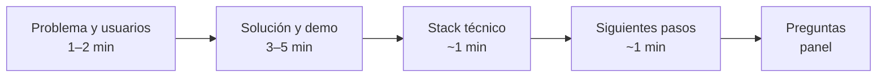
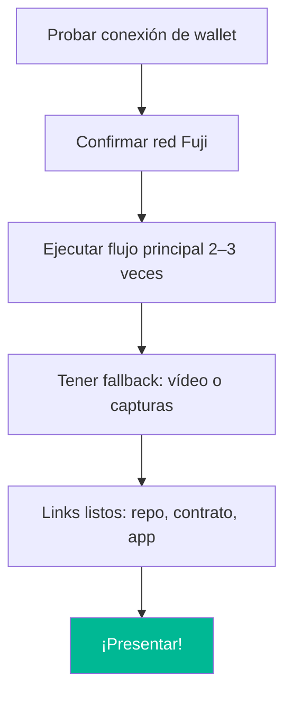
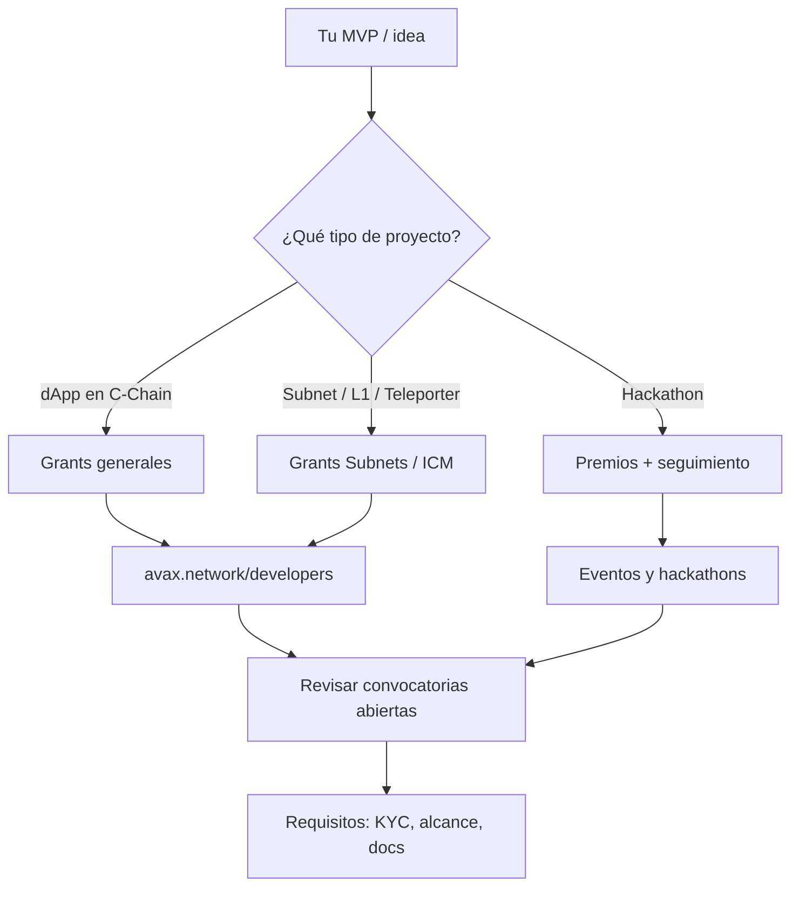
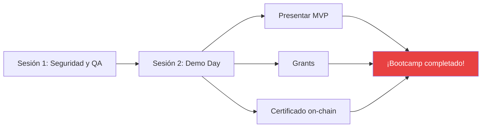

# Semana 4 · Sesión 2 — Demo Day

**Fecha:** 25 de marzo  
**Instructor:** Gerardo Vela  
**Tema:** Presentación final de proyectos ante panel de expertos, acceso a programas de Grants y cierre con certificados on-chain.

---

## Objetivos de la sesión

- Presentar tu **MVP** ante el panel con demo en vivo (o fallback).
- Conocer programas de **Grants** del ecosistema Avalanche y cómo postularte.
- Recibir **certificación on-chain** (POAPs/NFTs) y cerrar el bootcamp con claridad sobre próximos pasos.

---

## 1. Estructura de la presentación (5–10 min por equipo)

| Bloque | Tiempo | Contenido |
|--------|--------|-----------|
| **Problema y usuarios** | 1–2 min | Qué dolor resuelves y para quién (alineado con tu Lean Canvas). |
| **Solución y demo en vivo** | 3–5 min | Conectar wallet, mostrar flujo en Fuji (o mainnet): “el usuario hace X y ocurre Y”. |
| **Stack técnico** | ~1 min | Contratos (Fuji/Snowtrace), frontend, subnets/Teleporter si aplica. |
| **Siguientes pasos** | ~1 min | Mainnet, grants, comunidad, mejoras técnicas. |
| **Preguntas del panel** | Resto | Responder con claridad; si no sabes algo, dilo y anótalo para después. |

---

## 2. Demo en vivo: consejos prácticos

### Antes de subir

- **Probar** conexión, red Fuji y transacciones **minutos antes** (mismo navegador y dispositivo si es posible).
- **Fallback:** si la red o la wallet fallan, tener un **vídeo corto** o **capturas** del flujo para no quedarte en blanco.
- **Links:** repo (GitHub/GitLab), contrato en [Fuji Snowtrace](https://testnet.snowtrace.io/), y si tienes landing o app pública, el enlace listo para compartir en chat o slide.

### Durante la demo

- Hablar **mientras haces clic**: “Ahora conecto la wallet… cambio a Fuji… aquí envío la transacción…”
- Si una tx tarda, mencionar que Fuji a veces tarda unos segundos y seguir con el resto del flujo o con el fallback.
- Si algo falla: “Tenemos un fallback” y mostrar el vídeo o las capturas; después puedes comentar qué mejorarías.

---

## 3. Programas de Grants

El ecosistema Avalanche ofrece **grants** y **hackathons** para proyectos que construyan en la red, subnets o con Teleporter.

### Dónde buscar

| Recurso | Enlace / ruta |
|---------|----------------|
| **Avalanche — Developers** | [avax.network/developers](https://www.avax.network/developers) |
| **Ecosystem / Grants** | [avax.network/ecosystem](https://www.avax.network/ecosystem) |
| **Avalanche Foundation** | [avax.network/foundation](https://www.avax.network/foundation) |
| **Builders Hub — Grants** | [build.avax.network](https://build.avax.network) (sección Grants / Events) |

Revisar con el equipo **qué convocatorias están abiertas** y requisitos (KYC, alcance, documentación, plazos).

---

## 4. Certificación on-chain

- Entrega de **certificados on-chain** (POAPs/NFTs) como constancia de participación en el bootcamp.
- Las **instrucciones finales** (wallet a la que se envía, red, pasos) las dará el equipo del bootcamp al cierre de la sesión.
- Ten a mano la **wallet** (Core o la que uses) y verifica que tengas acceso a la red indicada para recibir el certificado.

---

## 5. Checklist final

- [ ] **Presentación** ensayada y con tiempo medido (5–10 min).
- [ ] **Demo** estable en Fuji (o fallback listo).
- [ ] **Links** listos: repo, contrato en Snowtrace, app/landing (si aplica).
- [ ] **Wallet** lista para recibir el certificado on-chain.
- [ ] **Grants:** al menos una convocatoria de interés revisada (requisitos y plazo).

---

## Resumen visual: Semana 4

---

## ¡Felicidades!

Has completado el **Bootcamp Avalanche**: desde fundamentos y C-Chain hasta subnets, interoperabilidad, prototipo, Lean Canvas, seguridad y Demo Day. Sigue construyendo en la red más rápida del mundo y forma parte del ecosistema **CriptoUNAM** y **Avalanche**.

---

## Enlaces útiles

- [Avalanche Ecosystem](https://www.avax.network/ecosystem)
- [Avalanche Developer](https://www.avax.network/developers)
- [Avalanche Foundation](https://www.avax.network/foundation)
- [Fuji Snowtrace](https://testnet.snowtrace.io/) (para compartir tu contrato)
- [Builders Hub](https://build.avax.network)

[← Seguridad y QA](./01-seguridad-qa.md) · [Volver al índice](../../README.md)
